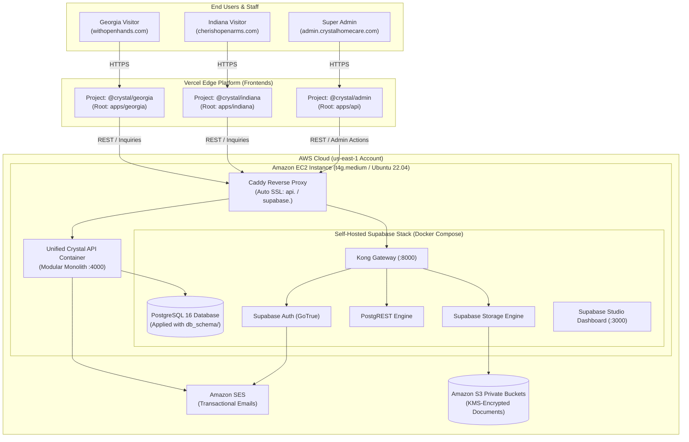

# Crystal Platform Deployment Plan: Vercel + AWS Self-Hosted Supabase

This document is the complete, step-by-step guide for deploying the **Crystal Multi-State Home Care Platform**.

---

## 1. Architecture & Traffic Flow Overview



---

## 2. Prerequisites & Required Accounts

Before beginning, ensure you have:
1. **GitHub Account & Repository:** Containing the `crystal` monorepo codebase.
2. **Vercel Account:** Pro or Hobby tier ([vercel.com](https://vercel.com)).
3. **AWS Account:** With Administrator IAM access ([aws.amazon.com](https://aws.amazon.com)).
4. **Domain Control:** Access to configure DNS records for:
   - `withopenhands.com` (Georgia)
   - `cherishopenarms.com` (Indiana)
   - `crystalhomecare.com` (Unified API, Admin, and Supabase subdomains)

---

## 3. Phase 1: AWS Core Infrastructure Setup

### Step 1.1: Create Amazon S3 Document Bucket
1. Open the **Amazon S3 Console** in `us-east-1`.
2. Click **Create bucket**.
3. Bucket name: `crystal-prod-documents-secure` (must be globally unique).
4. Settings:
   - **Block all public access:** `ENABLED` (Keep checked).
   - **Bucket Versioning:** `ENABLED`.
   - **Default encryption:** `Server-side encryption with AWS KMS keys (SSE-KMS)`.
5. Click **Create bucket**.

---

### Step 1.2: Configure Amazon SES for Email Delivery
1. Open **Amazon SES Console** in `us-east-1`.
2. Under **Configuration** $\rightarrow$ **Identities**, click **Create Identity**.
3. Select **Domain** and add your domains (`withopenhands.com`, `cherishopenarms.com`, `crystalhomecare.com`).
4. Copy the generated **DKIM CNAME records** into your DNS manager.
5. In SES Console $\rightarrow$ **Account dashboard** $\rightarrow$ **SMTP Settings**, click **Create SMTP credentials**.
6. Save the generated **SMTP Username** and **SMTP Password** securely.

---

### Step 1.3: Launch the EC2 Instance
1. Open **Amazon EC2 Console** in `us-east-1`.
2. Click **Launch instances**:
   - **Name:** `crystal-backend-prod`
   - **AMI:** Ubuntu Server 22.04 LTS (64-bit ARM)
   - **Instance Type:** `t4g.medium` (2 vCPU, 4GB RAM — ~$24.50/mo) or `t4g.large`
   - **Key Pair:** Create or select your `.pem` SSH key pair
   - **Storage:** 50 GB `gp3` SSD (Encrypted)
3. **Security Group Rules (Inbound):**
   - `SSH (22)`: Your IP address only
   - `HTTP (80)`: `0.0.0.0/0` (for Let's Encrypt SSL challenge)
   - `HTTPS (443)`: `0.0.0.0/0` (public encrypted web traffic)
4. Allocate and associate an **Elastic IP** to this instance so its public IP never changes.

---

### Step 1.4: Install Docker & Self-Hosted Supabase
SSH into your EC2 instance:
```bash
ssh -i your-key.pem ubuntu@<YOUR-EC2-ELASTIC-IP>
```

Install Docker and Docker Compose:
```bash
# Update and install Docker
sudo apt update && sudo apt upgrade -y
sudo apt install -y apt-transport-https ca-certificates curl software-properties-common
curl -fsSL https://download.docker.com/linux/ubuntu/gpg | sudo gpg --dearmor -o /usr/share/keyrings/docker-archive-keyring.gpg
echo "deb [arch=$(dpkg --print-architecture) signed-by=/usr/share/keyrings/docker-archive-keyring.gpg] https://download.docker.com/linux/ubuntu $(lsb_release -cs) stable" | sudo tee /etc/apt/sources.list.d/docker.list > /dev/null
sudo apt update
sudo apt install -y docker-ce docker-ce-cli containerd.io docker-compose-plugin
sudo usermod -aG docker ubuntu
```

Clone the official Supabase self-hosting repository:
```bash
# Clone Supabase Docker Compose repo
git clone --depth 1 https://github.com/supabase/supabase
cd supabase/docker

# Copy example environment configuration
cp .env.example .env
```

Edit `.env` with your secure credentials (`nano .env`):
```env
# Change default passwords
POSTGRES_PASSWORD=YourSuperSecureDbPassword123!
JWT_SECRET=YourSuperLongRandomJwtSecretMin32CharsLength!
ANON_KEY=YourGeneratedAnonJwtToken
SERVICE_ROLE_KEY=YourGeneratedServiceRoleJwtToken

# S3 Integration for Storage
STORAGE_BACKEND=s3
GLOBAL_S3_BUCKET=crystal-prod-documents-secure
AWS_ACCESS_KEY_ID=YOUR_AWS_ACCESS_KEY
AWS_SECRET_ACCESS_KEY=YOUR_AWS_SECRET_KEY
AWS_REGION=us-east-1

# SES Integration for SMTP Emails
SMTP_ADMIN_EMAIL=noreply@crystalhomecare.com
SMTP_HOST=email-smtp.us-east-1.amazonaws.com
SMTP_PORT=587
SMTP_USER=YOUR_SES_SMTP_USER
SMTP_PASS=YOUR_SES_SMTP_PASSWORD
SMTP_SENDER_NAME="Crystal Home Care System"
```

Start the Supabase container stack:
```bash
docker compose up -d
```

---

### Step 1.5: Apply the Baseline PostgreSQL Database Schema
Run the project's SQL schema snapshot directly into the database container:

```bash
# Copy db_schema/db_schema_20260901_v1.sql to your EC2 server and apply:
docker exec -i supabase-db psql -U postgres -d postgres < db_schema_20260901_v1.sql
```

This creates all tables, Row-Level Security policies, UUID triggers, and audit logging tables.

---

## 4. Phase 2: Reverse Proxy & Unified API Setup

To automatically handle SSL certificates and route traffic on your EC2 instance, use **Caddy**:

### Step 2.1: Install Caddy
```bash
sudo apt install -y debian-keyring debian-archive-keyring apt-transport-https
curl -1sLf 'https://dl.cloudsmith.io/public/caddy/stable/gpg.key' | sudo gpg --dearmor -o /usr/share/keyrings/caddy-stable-archive-keyring.gpg
curl -1sLf 'https://dl.cloudsmith.io/public/caddy/stable/debian.deb.txt' | sudo tee /etc/apt/sources.list.d/caddy-stable.list
sudo apt update
sudo apt install caddy
```

### Step 2.2: Configure `/etc/caddy/Caddyfile`
```caddy
# Unified API Endpoint
api.crystalhomecare.com {
    reverse_proxy localhost:3000
}

# Supabase Kong Gateway (Auth & PostgREST)
supabase.crystalhomecare.com {
    reverse_proxy localhost:8000
}

# Supabase Studio (Protected Dashboard)
studio.crystalhomecare.com {
    basicauth {
        admin $2a$14$Z... # Generated with 'caddy hash-password'
    }
    reverse_proxy localhost:3000
}
```

Restart Caddy to obtain free automated Let's Encrypt SSL certificates:
```bash
sudo systemctl restart caddy
```

---

## 5. Phase 3: Vercel Frontend Deployments

You will create **three separate projects** in your Vercel dashboard, all connected to your single GitHub repository.

---

### Project 1: Georgia Website (`withopenhands.com`)
1. In Vercel, click **Add New** $\rightarrow$ **Project** $\rightarrow$ Select `crystal`.
2. **Project Name:** `crystal-georgia`.
3. **Framework Preset:** `Next.js`.
4. **Root Directory:** Edit $\rightarrow$ select `apps/georgia`.
5. **Build & Development Settings:**
   - Build Command: `npx turbo run build --filter=@crystal/georgia`
   - Output Directory: `.next`
6. **Environment Variables:**
   | Variable | Value |
   | :--- | :--- |
   | `NEXT_PUBLIC_API_URL` | `https://api.crystalhomecare.com` |
   | `NEXT_PUBLIC_SUPABASE_URL` | `https://supabase.crystalhomecare.com` |
   | `NEXT_PUBLIC_SUPABASE_ANON_KEY` | *(Your Supabase Anon Key)* |
   | `NEXT_PUBLIC_STATE_CODE` | `GA` |
7. Click **Deploy**.
8. Go to **Settings** $\rightarrow$ **Domains** $\rightarrow$ Add `withopenhands.com` and `www.withopenhands.com`.

---

### Project 2: Indiana Website (`cherishopenarms.com`)
1. In Vercel, click **Add New** $\rightarrow$ **Project** $\rightarrow$ Select `crystal`.
2. **Project Name:** `crystal-indiana`.
3. **Framework Preset:** `Next.js`.
4. **Root Directory:** Edit $\rightarrow$ select `apps/indiana`.
5. **Build & Development Settings:**
   - Build Command: `npx turbo run build --filter=@crystal/indiana`
   - Output Directory: `.next`
6. **Environment Variables:**
   | Variable | Value |
   | :--- | :--- |
   | `NEXT_PUBLIC_API_URL` | `https://api.crystalhomecare.com` |
   | `NEXT_PUBLIC_SUPABASE_URL` | `https://supabase.crystalhomecare.com` |
   | `NEXT_PUBLIC_SUPABASE_ANON_KEY` | *(Your Supabase Anon Key)* |
   | `NEXT_PUBLIC_STATE_CODE` | `IN` |
7. Click **Deploy**.
8. Go to **Settings** $\rightarrow$ **Domains** $\rightarrow$ Add `cherishopenarms.com` and `www.cherishopenarms.com`.

---

### Project 3: Unified Admin Dashboard (`admin.crystalhomecare.com`)
1. In Vercel, click **Add New** $\rightarrow$ **Project** $\rightarrow$ Select `crystal`.
2. **Project Name:** `crystal-admin`.
3. **Framework Preset:** `Next.js`.
4. **Root Directory:** Edit $\rightarrow$ select `apps/api`.
5. **Build & Development Settings:**
   - Build Command: `npx turbo run build --filter=@crystal/api`
   - Output Directory: `.next`
6. **Environment Variables:**
   | Variable | Value |
   | :--- | :--- |
   | `NEXT_PUBLIC_API_URL` | `https://api.crystalhomecare.com` |
   | `NEXT_PUBLIC_SUPABASE_URL` | `https://supabase.crystalhomecare.com` |
   | `NEXT_PUBLIC_SUPABASE_ANON_KEY` | *(Your Supabase Anon Key)* |
   | `SUPABASE_SERVICE_ROLE_KEY` | *(Your Supabase Service Role Key - Secret)* |
7. Click **Deploy**.
8. Go to **Settings** $\rightarrow$ **Domains** $\rightarrow$ Add `admin.crystalhomecare.com`.

---

## 6. Phase 4: DNS Configuration Table

Add these DNS records in your domain registrar (e.g. GoDaddy, Namecheap, Cloudflare):

| Domain / Host | Type | Value | Routing Destination |
| :--- | :--- | :--- | :--- |
| `withopenhands.com` | `A` | `76.76.21.21` | Vercel (Georgia App) |
| `www.withopenhands.com` | `CNAME` | `cname.vercel-dns.com` | Vercel (Georgia App) |
| `cherishopenarms.com` | `A` | `76.76.21.21` | Vercel (Indiana App) |
| `www.cherishopenarms.com` | `CNAME` | `cname.vercel-dns.com` | Vercel (Indiana App) |
| `admin.crystalhomecare.com` | `CNAME` | `cname.vercel-dns.com` | Vercel (Admin Dashboard) |
| `api.crystalhomecare.com` | `A` | `<EC2-ELASTIC-IP>` | AWS EC2 (Unified API) |
| `supabase.crystalhomecare.com`| `A` | `<EC2-ELASTIC-IP>` | AWS EC2 (Supabase Gateway) |

---

## 7. Phase 5: Verification & Go-Live Checklist

Once DNS propagates (usually 5–15 minutes):

- [ ] **Georgia Site Check:** Navigate to `https://withopenhands.com` $\rightarrow$ Confirm Teal/Gold branding, Atlanta office, and GA license number.
- [ ] **Indiana Site Check:** Navigate to `https://cherishopenarms.com` $\rightarrow$ Confirm Navy/Coral branding, Indianapolis office, and IN license number.
- [ ] **Lead Capture Test:** Submit a test message on `https://withopenhands.com/contact` $\rightarrow$ Verify that the inquiry record appears in PostgreSQL (`public.public_inquiries`) and SES sends an email.
- [ ] **Admin Dashboard Check:** Navigate to `https://admin.crystalhomecare.com/admin` $\rightarrow$ Verify that the Super Admin dashboard lists the newly submitted inquiry under Georgia.
- [ ] **Supabase Health Check:** Navigate to `https://supabase.crystalhomecare.com/health` $\rightarrow$ Confirm HTTP 200 response.

---

## 8. Operating Budget & Monthly Cost Breakdown

| Component | Service | Specification | Monthly Cost |
| :--- | :--- | :--- | :--- |
| **Frontends** | Vercel | 3 Projects (Hobby / Pro) | $0 – $20 / mo |
| **Backend & Database** | AWS EC2 | `t4g.medium` (2 vCPU, 4GB RAM) + 50GB gp3 SSD | ~$28.50 / mo |
| **HIPAA Document Storage**| AWS S3 | Standard Private Bucket (50 GB) + KMS | ~$2.00 / mo |
| **Transactional Email** | AWS SES | DKIM-verified delivery (~10k emails) | ~$1.00 / mo |
| **Total Operating Cost** | | | **~$31.50 – $51.50 / month** |

*(This satisfies the agreed $100–$200/month infrastructure budget with significant room to scale).*

---

## 9. Automated Database Backups & Maintenance

On your EC2 instance, set up a daily automated database backup cron job that uploads encrypted dumps to S3:

```bash
# Add to crontab (crontab -e):
0 3 * * * docker exec supabase-db pg_dump -U postgres postgres | gzip | aws s3 cp - s3://crystal-prod-documents-secure/backups/db_$(date +\%Y\%m\%d).sql.gz
```
