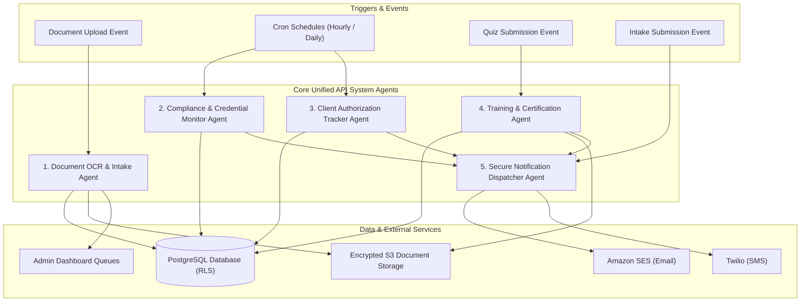
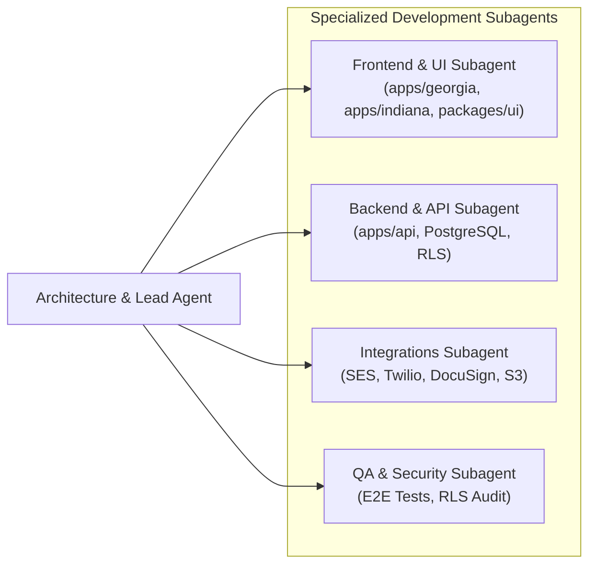

# Agents Specification & Developer Guidelines

## 1. System Agent Architecture Overview

Crystal uses an intelligent hybrid agent architecture combining **event-driven system agents**, **scheduled background automation workers**, and **specialized developer subagents** to automate compliance workflows, accelerate onboarding, and maintain airtight HIPAA-compliant data operations within the **Unified API (Modular Monolith)**.

---

## 2. Platform Operational Agents

### 2.1 Document OCR & Intake Agent (`Agent-DocOCR`)
- **Role & Purpose:** Pre-processes, categorizes, and validates all caregiver credential uploads and client intake documentation immediately upon submission to S3/Storage.
- **Trigger:** Event-driven trigger in the Unified API `documents` module upon document upload confirmation.
- **Capabilities & Workflow:**
  1. Inspects image/PDF uploads for legibility, orientation, and minimum resolution.
  2. Extracts key fields using OCR/vision parsing:
     - **Driver's License:** Name, DOB, Address, License Number, Expiration Date, State.
     - **CPR / CNA / HHA Certifications:** Certificate ID, Issuing Body, Expiration Date.
     - **TB Test / Physical Exam:** Test Date, Read Date, Physician Signature Flag.
     - **Medicaid / Insurance Cards:** Policy Number, Group Number, Payer ID.
  3. Pre-populates document metadata fields in PostgreSQL (`expiration_date`, `extracted_text`).
  4. Flags discrepancies (e.g. name mismatch against user profile or blurry scan) and notifies the Admin review queue.
- **Safety Boundary:** Never auto-approves documents. All extractions are presented to human coordinators as "Suggested Extraction" for 1-click verification.

---

### 2.2 Compliance & Credential Monitor Agent (`Agent-Compliance`)
- **Role & Purpose:** Continuously monitors all active caregiver credentials against state-mandated licensing and regulatory timelines (Georgia DCH & Indiana FSSA standards).
- **Trigger:** Daily cron schedule (`0 0 * * *` at 00:00 UTC) executed by the background worker.
- **Capabilities & Workflow:**
  1. Queries all active caregivers in `caregivers` and scans their related `credentials` and `documents`.
  2. Evaluates expiration dates against notification thresholds:
     - **90 Days Prior:** Informational portal alert.
     - **60 Days Prior:** Email reminder to caregiver.
     - **30 Days Prior:** Urgent Email + SMS reminder.
     - **15 & 7 Days Prior:** High-priority escalation reminder + State Admin dashboard flag.
     - **0 Days (Expired):** Updates caregiver `compliance_status` to `non_compliant` and sends immediate action alert.
  3. Detects missing mandatory document categories for onboarding applicants.
  4. Prepares daily digest reports for State Administrators summarizing compliant vs non-compliant personnel.

---

### 2.3 Client Authorization Tracker Agent (`Agent-AuthTracker`)
- **Role & Purpose:** Guarantees continuity of care by proactively tracking insurance and Medicaid prior authorizations, preventing service lapses or unpaid claims.
- **Trigger:** Daily cron schedule (`0 1 * * *` at 01:00 UTC) executed by the background worker.
- **Capabilities & Workflow:**
  1. Scans `authorizations` table across all active clients.
  2. Tracks expiration dates and unit consumption:
     - **60-Day & 30-Day Expiration Windows:** Dispatches re-authorization trigger to Agency Staff.
     - **Unit Exhaustion Warnings:** Flags authorizations where 80%+ of approved hours have been scheduled.
  3. Automatically updates authorization status (`active` $\rightarrow$ `expiring_soon` $\rightarrow$ `expired`).
  4. Generates an exportable renewal pipeline view on the Administrator Dashboard.

---

### 2.4 Training & Certification Agent (`Agent-TrainingCert`)
- **Role & Purpose:** Evaluates in-service training quiz submissions, tracks accumulated continuing education hours, and automatically generates tamper-proof PDF completion certificates.
- **Trigger:** Event-driven on `POST /api/v1/training/courses/:id/submit-quiz`.
- **Capabilities & Workflow:**
  1. Grades submitted quiz responses against course answer keys and passing score thresholds (typically $\ge 80\%$).
  2. Updates `training_records` table (`passed` / `failed`, score percentage).
  3. If passed:
     - Calculates accumulated state continuing education hours.
     - Invokes PDF generator (`pdf-lib` / `@react-pdf/renderer`).
     - Emits signed PDF certificate containing: Caregiver Name, Course Title, Completion Date, Hours Earned, State Code (GA/IN), and unique Verification Hash.
     - Uploads certificate to private S3 bucket and records link in `training_records`.
     - Dispatches congratulations email with direct certificate download link.
  4. If failed:
     - Prompts caregiver with review feedback and indicates remaining retry attempts.

---

### 2.5 Secure Notification Dispatcher Agent (`Agent-Notifier`)
- **Role & Purpose:** Orchestrates multi-channel delivery (Email via Amazon SES and SMS via Twilio) while strictly enforcing HIPAA-compliant message formatting.
- **Trigger:** Internal queue worker / event consumer in Unified API `notifications` module.
- **HIPAA Guardrails:**
  - **Zero PHI/PII in Plaintext:** Messages **never** include patient names, clinical diagnoses, medical document contents, or SSNs.
  - **Template Standardization:** Standardized templates format messages with generic security-safe notices:
    * *Email Example:* "Hello [First Name], you have 1 urgent compliance item requiring attention in the Cherish Open Arms portal. Click here to review: [Secure Auth Link]"
    * *SMS Example:* "With Open Hands Notice: Your CPR Certification expires in 15 days. Please update your document at [Short URL]."
  - **Delivery Tracking:** Logs dispatch timestamp, provider message ID, and delivery status in `security_audit_logs`.

---

## 3. Mandatory Architectural Rules & Guardrails for AI & Developers

When implementing, refactoring, or generating code for the Crystal platform, all developers and AI coding agents must adhere strictly to these 9 core rules:

```mermaid
graph TD
    Rule1["1. Multi-State Frontends + Unified API"]
    Rule2["2. Modular Monolith Backend (No Microservices)"]
    Rule3["3. Zero Business Logic Duplication in Frontends"]
    Rule4["4. No Bypassing the Unified API"]
    Rule5["5. Enforce Security on Backend & Database RLS"]
    Rule6["6. Strict Tenant & State Boundary Isolation"]
    Rule7["7. Configuration-Driven State Variations"]
    Rule8["8. Ephemeral Signed Access for Sensitive Documents"]
    Rule9["9. Preserve Established Tech Stack & Simplicity"]
```

### Rule 1: Multi-State Frontends + Unified API
- **Do not create a separate backend for each state.**
- State frontends (`apps/georgia`, `apps/indiana`, future `apps/florida`) must all communicate with the single **Unified Crystal API** (`apps/api`).

### Rule 2: Modular Monolith Backend (No Microservices)
- **Do not split the backend into microservices or distributed RPC services.**
- The Unified API is one deployable application organized into clean logical internal modules (`auth`, `users`, `caregivers`, `clients`, `documents`, `credentials`, `authorizations`, `training`, `notifications`, `reports`, `audit`, `integrations`).
- Keep backend modules logically separated through TypeScript interfaces and service boundaries.

### Rule 3: Zero Business Logic Duplication in Frontends
- State-specific Next.js applications are responsible for UI, routing, presentation, and form capture.
- **Do not duplicate business rules, validation logic, credential checks, or authorization evaluation inside state frontend apps.** Centralize all business rules in the Unified API.

### Rule 4: No Bypassing the Unified API
- Frontend state applications must never connect directly to the database or invoke third-party transactional APIs (SES, Twilio, DocuSign) directly. All requests must route through the Unified API.

### Rule 5: Never Rely Solely on Frontend Authorization
- Frontend UI guards and hidden buttons are strictly for user experience.
- Every API endpoint must independently verify JWT authentication, user role, and state/organization permissions.
- Database operations must be protected by PostgreSQL Row-Level Security (RLS).

### Rule 6: Respect Organization & State Boundaries
- Every query and mutation involving tenant-scoped entities (`caregivers`, `clients`, `documents`, `authorizations`, `credentials`) must validate and enforce `org_id` context.
- A user belonging to Georgia (*With Open Hands*) must never be able to view, query, or mutate Indiana (*Cherish Open Arms*) records.

### Rule 7: Prefer Configuration-Driven State Differences
- When Georgia and Indiana require different behaviors (e.g. licensing disclosures, office addresses, branding colors, required training hours), use database-driven organization configuration (`organizations.branding_config` / JSONB settings) or shared constants rather than duplicating entire code files.

### Rule 8: Ephemeral Signed Access for Sensitive Documents
- Documents are sensitive PII/PHI. Never store documents in public directories.
- Always upload to private S3/Storage buckets and deliver file access exclusively through short-lived (15-minute) cryptographically signed URLs after verifying user authorization.

### Rule 9: Preserve Tech Stack & Architectural Simplicity
- Avoid unnecessary message brokers (Kafka/RabbitMQ), additional backend frameworks, or multi-database topologies.
- Standard stack: **Next.js 14+ App Router**, **Tailwind CSS + shadcn/ui**, **Node.js/TypeScript (Unified API)**, **PostgreSQL 15+ with RLS**, **Supabase Storage / AWS S3**, **Amazon SES**, **Twilio**.

---

## 4. Responsibility Boundary Matrix

| Component Layer | What Belongs Here | What Does NOT Belong Here |
| :--- | :--- | :--- |
| **Next.js State Applications** (`apps/georgia`, `apps/indiana`) | • UI Pages and layouts • State-specific marketing content • Form inputs, client-side maskings • UI state machines (idle, submitting, error) • Theme overrides (Deep Teal vs Navy) | • Database queries or direct SQL • Authentication credential hashing • Credential expiration calculations • Direct SES/Twilio/DocuSign API keys • Duplicated backend APIs |
| **Unified Crystal API** (`apps/api`) | • Centralized business logic & rules • Authentication & session token lifecycle • RBAC & organization access control • Server-side Zod payload validation • Quiz evaluation & certificate generation • Multi-channel notification queueing • Secure presigned URL generation • Third-party cloud integration adapters | • UI components or HTML rendering • State-specific duplicated endpoints (e.g. `/api/georgia/...`) • Microservice network hops • Exposing raw unverified database access |
| **Database & Infrastructure** (PostgreSQL, RLS, Storage) | • Relational tables & integrity constraints • PostgreSQL Row-Level Security (RLS) • Foreign keys to `organizations` • Encrypted object storage (AES-256) • Immutable security audit log persistence | • Plaintext passwords or secrets • Public unprotected file storage • Unrestricted cross-tenant queries |

---

## 5. Developer & Coding Subagents

When building, testing, and maintaining the platform codebase, the following specialized subagents are utilized during development workflows:

### 5.1 Frontend & UI Subagent (`subagent-frontend`)
- **Focus:** Next.js 14+ App Router, state frontend applications (`apps/georgia`, `apps/indiana`), shared `@crystal/ui` components, accessible forms with `react-hook-form` + `@crystal/validation`, responsive layouts.
- **Tools:** TypeScript, Tailwind CSS, shadcn/ui, Lucide Icons.

### 5.2 Backend & API Subagent (`subagent-backend`)
- **Focus:** Unified Crystal API (`apps/api`), modular domain modules, PostgreSQL schema design, migration scripts, Row-Level Security (RLS) policies, database performance, and transaction safety.
- **Tools:** TypeScript, Node.js, SQL, Supabase CLI, Docker, pgTAP.

### 5.3 API & Integration Subagent (`subagent-integration`)
- **Focus:** Implementing resilient integration adapters (Amazon SES, Twilio SMS, DocuSign/SignWell e-signatures, Cloudflare Stream, AWS S3 presigned URLs), webhook signature verification, and queue handlers.
- **Tools:** Node.js, TypeScript, AWS SDK, Axios.

### 5.4 QA & Security Audit Subagent (`subagent-qa-security`)
- **Focus:** End-to-end multi-state journey testing (Playwright), RLS isolation test matrices (verifying GA users cannot query IN records), automated penetration scanning, and zero-PHI notification verification.
- **Tools:** Playwright, Jest, OWASP ZAP, ESLint security rules.

---

## 6. Agent Error Handling & Resilience Matrix

| Agent | Failure Mode | Auto-Recovery & Mitigation |
| :--- | :--- | :--- |
| `Agent-DocOCR` | Blurry image / unparseable text | Flags document as `needs_manual_review`, assigns task to coordinator queue without blocking applicant progress. |
| `Agent-Compliance` | Database timeout / lock contention | Automatic retry with exponential backoff (3 attempts); alerts Super Admin via Sentry/CloudWatch if unresolved after 1 hour. |
| `Agent-TrainingCert` | PDF generation failure | Enqueues retry task; marks status as `cert_pending_generation`; notifies user certificate will be ready in minutes. |
| `Agent-Notifier` | SES / Twilio rate limit or bounce | Fallback to secondary notification channel; marks undelivered recipients in admin compliance alert list. |

