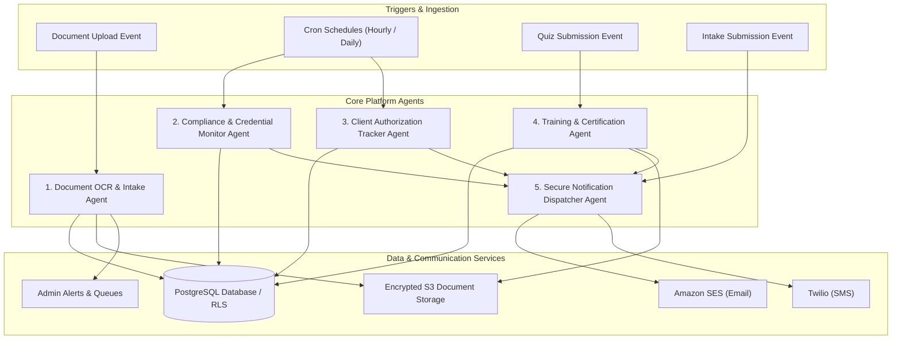
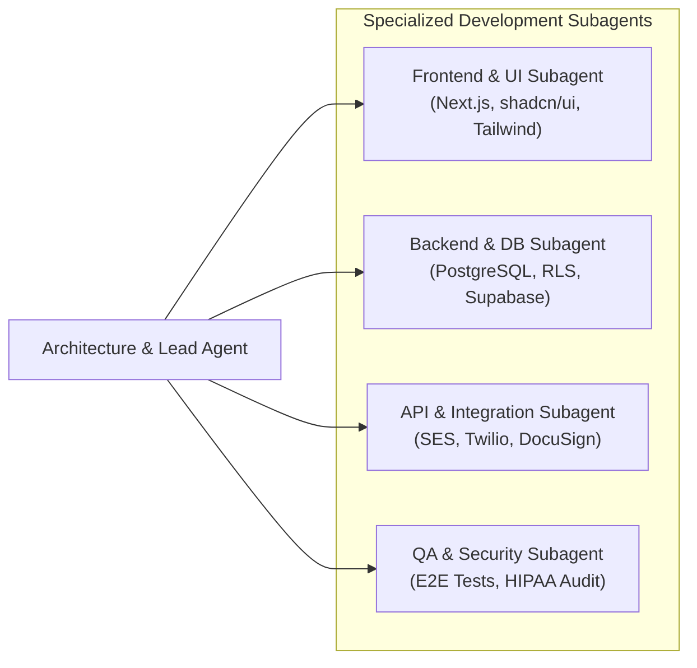

# Agents Specification & Operational Workflows

## 1. System Agent Architecture Overview

The platform uses an intelligent hybrid agent architecture combining **event-driven system agents**, **scheduled background automation workers**, and **specialized AI subagents** to automate complex compliance workflows, accelerate caregiver/client onboarding, and maintain airtight HIPAA-compliant data operations.

---

## 2. Platform Operational Agents

### 2.1 Document OCR & Intake Agent (`Agent-DocOCR`)

- **Role & Purpose:** Pre-processes, categorizes, and validates all caregiver credential uploads and client intake documentation immediately upon submission to S3/Storage.
- **Trigger:** Webhook / Database trigger on `INSERT` into `caregiver_documents` or `client_documents`.
- **Capabilities & Workflow:**
  1. Inspects image/PDF uploads for legibility, orientation, and minimum resolution.
  2. Extracts key fields using OCR/vision parsing:
     - **Driver's License:** Name, DOB, Address, License Number, Expiration Date, State.
     - **CPR / CNA / HHA Certifications:** Certificate ID, Issuing Body, Expiration Date.
     - **TB Test / Physical Exam:** Test Date, Read Date, Physician Signature Flag.
     - **Medicaid / Insurance Cards:** Policy Number, Group Number, Payer ID.
  3. Pre-populates document metadata fields in PostgreSQL (`expiration_date`, `extracted_text`).
  4. Flags discrepancies (e.g. name mismatch against user profile or blurry scan) and notifies the Admin review queue.
- **Safety Boundary:** Never auto-approves documents. All extractions are presented to human coordinators as "Suggested Extraction" for 1-click verification.

---

### 2.2 Compliance & Credential Monitor Agent (`Agent-Compliance`)

- **Role & Purpose:** Continuously monitors all active caregiver credentials against state-mandated licensing and regulatory timelines (Georgia DCH & Indiana FSSA standards).
- **Trigger:** Daily cron schedule (`0 0 * * *` at 00:00 UTC).
- **Capabilities & Workflow:**
  1. Queries all active caregivers in `caregiver_profiles` and scans their related `caregiver_documents`.
  2. Evaluates expiration dates against notification thresholds:
     - **90 Days Prior:** Informational portal alert.
     - **60 Days Prior:** Email reminder to caregiver.
     - **30 Days Prior:** Urgent Email + SMS reminder.
     - **15 & 7 Days Prior:** High-priority escalation reminder + State Admin dashboard flag.
     - **0 Days (Expired):** Updates caregiver `compliance_status` to `non_compliant` and sends immediate action alert.
  3. Detects missing mandatory document categories for onboarding applicants.
  4. Prepares daily digest reports for State Administrators summarizing compliant vs non-compliant personnel.

---

### 2.3 Client Authorization Tracker Agent (`Agent-AuthTracker`)

- **Role & Purpose:** Guarantees continuity of care by proactively tracking insurance and Medicaid prior authorizations, preventing service lapses or unpaid claims.
- **Trigger:** Daily cron schedule (`0 1 * * *` at 01:00 UTC).
- **Capabilities & Workflow:**
  1. Scans `authorizations` table across all active clients.
  2. Tracks expiration dates and unit consumption:
     - **60-Day & 30-Day Expiration Windows:** Dispatches re-authorization trigger to Agency Staff.
     - **Unit Exhaustion Warnings:** Flags authorizations where 80%+ of approved hours have been scheduled.
  3. Automatically updates authorization status (`active` $\rightarrow$ `expiring_soon` $\rightarrow$ `expired`).
  4. Generates an exportable renewal pipeline view on the Administrator Dashboard.

---

### 2.4 Training & Certification Agent (`Agent-TrainingCert`)

- **Role & Purpose:** Evaluates in-service training quiz submissions, tracks accumulated continuing education hours, and automatically generates tamper-proof PDF completion certificates.
- **Trigger:** Event-driven on `POST` to `/api/training/submit-quiz`.
- **Capabilities & Workflow:**
  1. Grades submitted quiz responses against course answer keys and passing score thresholds (typically $\ge 80\%$).
  2. Updates `training_progress` record (`passed` / `failed`, score percentage).
  3. If passed:
     - Calculates accumulated state continuing education hours.
     - Invokes headless PDF generator (e.g. `@react-pdf/renderer` or `pdf-lib`).
     - Emits signed PDF certificate containing: Caregiver Name, Course Title, Completion Date, Hours Earned, State Code (GA/IN), and unique Verification Hash.
     - Uploads certificate to private S3 bucket and records link in `certificates` table.
     - Dispatches congratulations email with direct certificate download link.
  4. If failed:
     - Prompts caregiver with review feedback and indicates remaining retry attempts.

---

### 2.5 Secure Notification Dispatcher Agent (`Agent-Notifier`)

- **Role & Purpose:** Orchestrates multi-channel delivery (Email via Amazon SES and SMS via Twilio) while strictly enforcing HIPAA-compliant message formatting.
- **Trigger:** Internal queue worker / event consumer (`notifications_queue`).
- **HIPAA Guardrails:**
  - **Zero PHI/PII in Plaintext:** Messages **never** include patient names, clinical diagnoses, medical document contents, or SSNs.
  - **Template Standardization:** Standardized templates format messages with generic security-safe notices:
    * *Email Example:* "Hello [First Name], you have 1 urgent compliance item requiring attention in the Cherish Open Arms portal. Click here to review: [Secure Auth Link]"
    * *SMS Example:* "With Open Hands Notice: Your CPR Certification expires in 15 days. Please update your document at [Short URL]."
- **Delivery Tracking:** Logs dispatch timestamp, provider message ID, and delivery status in `notification_logs`.

---

## 3. Developer & Coding Subagents

When building, testing, and maintaining the platform codebase, the following specialized subagents are utilized during development workflows:

### 3.1 Frontend & UI Subagent (`subagent-frontend`)
- **Focus:** Next.js 14+ App Router, dynamic state theming (With Open Hands vs Cherish Open Arms), responsive layouts, shadcn/ui component integration, accessible form validations (`zod` + `react-hook-form`).
- **Tools:** TypeScript, Tailwind CSS, Lucide Icons.

### 3.2 Backend & Database Subagent (`subagent-backend`)
- **Focus:** PostgreSQL schema design, migration scripts, Row-Level Security (RLS) policies, PostgREST query optimization, Supabase Auth hook integration, and database index performance.
- **Tools:** SQL, Supabase CLI, Docker, pgTAP.

### 3.3 API & Integration Subagent (`subagent-integration`)
- **Focus:** Implementing resilient webhook handlers, DocuSign / SignWell e-signature integrations, Cloudflare Stream video playback hooks, Amazon SES email templates, and Twilio SMS queues.
- **Tools:** Node.js, Axios, Webhook signature verification, S3 SDK.

### 3.4 QA & Security Audit Subagent (`subagent-qa-security`)
- **Focus:** End-to-end user journey testing (Playwright / Cypress), RLS isolation test matrices (verifying GA users cannot query IN records), penetration test scans, and zero-PHI notification verification.
- **Tools:** Playwright, Jest, OWASP ZAP, ESLint security rules.

---

## 4. Agent Error Handling & Resilience Matrix

| Agent | Failure Mode | Auto-Recovery & Mitigation |
| :--- | :--- | :--- |
| `Agent-DocOCR` | Blurry image / unparseable text | Flags document as `needs_manual_review`, assigns task to coordinator without blocking applicant progress. |
| `Agent-Compliance` | Database timeout / lock contention | Automatic retry with exponential backoff (3 attempts); alerts Super Admin via Sentry/CloudWatch if unresolved after 1 hour. |
| `Agent-TrainingCert` | PDF generation failure | Enqueues retry task; marks status as `cert_pending_generation`; notifies user their certificate will be ready in minutes. |
| `Agent-Notifier` | SES / Twilio rate limit or bounce | Fallback to secondary notification channel; marks undelivered recipients in admin compliance alert list. |
