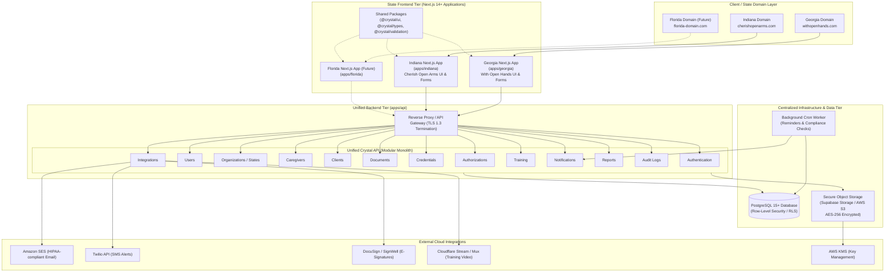
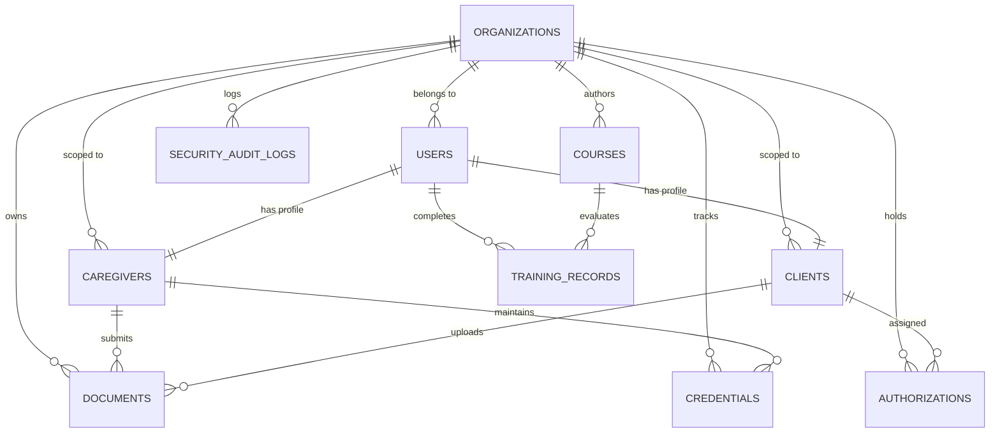
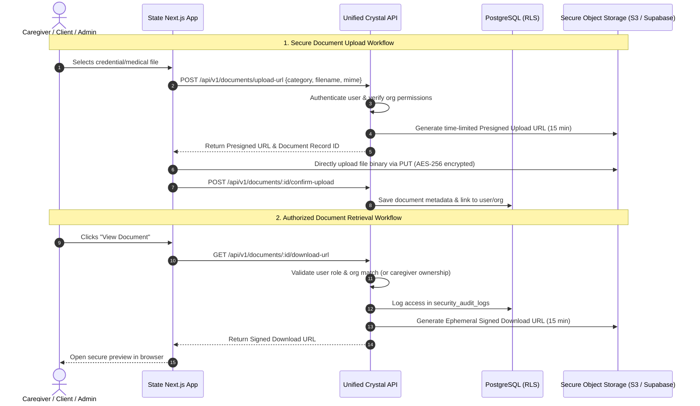
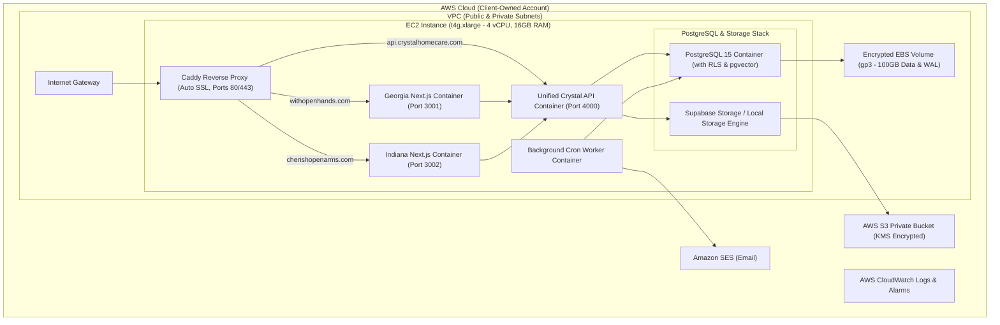

# Technical Architecture Specification

## 1. System Overview & Core Architecture

Crystal is engineered as a **Multi-State Frontend + Unified API + Centralized Backend Infrastructure** platform. It consolidates independent state agency operations (**Georgia — With Open Hands** and **Indiana — Cherish Open Arms**) onto a single scalable backend, while allowing future state expansions (e.g., **Florida**) to be added without rebuilding or duplicating the core platform.

```text
Georgia Domain (withopenhands.com)
      ↓
Georgia Next.js App
      │
      ├──────────────┐
      │              │
Indiana Domain (cherishopenarms.com)
      ↓              │
Indiana Next.js App  │
      │              │
      └──────┬───────┘
             ↓
      Unified Crystal API
       (Modular Monolith)
             ↓
   ┌─────────┼──────────┐
   ↓         ↓          ↓
PostgreSQL Storage   External Services
/Supabase             SES / Twilio /
                      DocuSign / Video
```



---

## 2. Unified API as a Modular Monolith

> [!IMPORTANT]
> Crystal is deliberately designed **not** as a collection of microservices, but as a **Modular Monolith**.
> It is **one single backend application** containing clearly separated internal logical modules. This keeps system complexity, operations, and infrastructure overhead low while establishing clean, decoupled boundaries between business domains.

```text
Crystal API (Modular Monolith)
│
├── Authentication       (Session tokens, password hashing, MFA, JWT validation)
├── Users                (User profiles, account statuses, profile mutations)
├── Organizations/States (Tenant definitions, branding configs, state metadata)
├── Caregivers           (Application intake, onboarding funnels, profile data)
├── Clients              (Intake submissions, care plans, admission tracking)
├── Documents            (Metadata indexing, signed URL issuance, file verification)
├── Credentials          (Expiration tracking, compliance status evaluation)
├── Authorizations       (Payer/Medicaid authorization dates, unit tracking)
├── Training             (Course catalogs, quiz scoring, certificate PDF generation)
├── Notifications        (Email/SMS templating, queueing, zero-PHI formatting)
├── Reports              (Aggregations, compliance matrices, CSV/PDF exports)
├── Audit Logs           (Immutable HIPAA access logs, mutation auditing)
└── Integrations         (Adapters for SES, Twilio, DocuSign, Cloudflare Stream, S3)
```

### 2.1 Module Boundary Rules
1. **Single Deployable Unit:** All modules are compiled, packaged, and deployed together as the Unified Crystal API.
2. **Strict Internal Interfaces:** Modules communicate through documented TypeScript interfaces and domain service functions, never through ad-hoc raw queries bypassing domain rules.
3. **No Inter-Service Network Calls:** Modules do not perform HTTP/gRPC roundtrips to communicate with each other; invocations occur in-process.
4. **Shared Database Context:** Modules operate against the centralized PostgreSQL database with transactions when atomic cross-module workflows are required.

---

## 3. Frontend vs Backend vs Database Responsibilities

A clear boundary is enforced across all layers of the architecture:

```mermaid
graph LR
    subgraph Frontend["1. Next.js State Applications"]
        F1["Page Layouts & Routing"]
        F2["State Marketing & Content"]
        F3["UI Forms & Input Masking"]
        F4["Client-side Validation"]
        F5["Presentation Logic & Themes"]
    end

    subgraph Backend["2. Unified Crystal API"]
        B1["Central Business Logic"]
        B2["Authorization & RBAC"]
        B3["State Access Control"]
        B4["Data Access & Mutations"]
        B5["Credential & Training Engines"]
        B6["External Integrations"]
        B7["Security Enforcement"]
    end

    subgraph Database["3. PostgreSQL / Supabase / Storage"]
        D1["Data Persistence"]
        D2["Row-Level Security (RLS)"]
        D3["Integrity & Constraints"]
        D4["Secure AES-256 Object Storage"]
        D5["Audit Log Immutability"]
    end

    Frontend -->|HTTP / JSON via Shared DTOs| Backend
    Backend -->|SQL Queries & S3 SDK| Database
```



| Layer | Component | Core Responsibilities | What It Must NOT Do |
| :--- | :--- | :--- | :--- |
| **Frontend** | **State Next.js Apps** (`apps/georgia`, `apps/indiana`) | • UI rendering & SSR marketing pages<br/>• Routing & navigation<br/>• State-specific text, licenses, disclosures<br/>• Form controls & user interaction state<br/>• Presentation-layer theming | • Duplicate business logic<br/>• Perform direct database writes<br/>• Handle third-party secrets (SES, Twilio)<br/>• Rely on client-only auth checks |
| **Backend** | **Unified Crystal API** (`apps/api`) | • Centralized business logic<br/>• Authentication & session verification<br/>• Role-based & state-based authorization<br/>• Server-side Zod validation<br/>• Workflows (quiz grading, cert generation)<br/>• External service orchestration | • Duplicate endpoints per state<br/>• Depend on frontend state for security<br/>• Split into microservices |
| **Database & Storage** | **PostgreSQL 15+ / S3 / Supabase** | • Persistent relational data storage<br/>• PostgreSQL Row-Level Security (RLS)<br/>• Foreign key & check constraints<br/>• Encrypted document storage (AES-256)<br/>• Ephemeral presigned URL delivery | • Publicly expose unauthenticated files<br/>• Allow cross-tenant data queries |

---

## 4. State & Organization Isolation Model

Crystal enforces strict multi-tenant isolation at both the **API layer** and the **database kernel layer**:

```text
Georgia User Request
   ↓
Who is the user?            → JWT claims: user_id = 'usr_123'
What role do they have?     → role = 'state_admin'
What organization/state?    → org_id = 'org_ga_456' (Georgia / With Open Hands)
What resources allowed?     → Only Georgia records (`org_id = org_ga_456`)
   ↓
API Authorization Guard     → Validates role permissions and tenant scope
   ↓
PostgreSQL Database RLS     → Enforces `USING (org_id = current_user_org())`
   ↓
Georgia-Authorized Data Returned
```

### 4.1 Isolation Guarantees
1. **No Client-Side Reliance:** A Georgia user or coordinator **cannot** query or mutate Indiana records simply by altering a request parameter, header, or URL.
2. **Context Derivation:** State context is derived directly from the authenticated user session and validated organization membership, not from client-supplied parameters.
3. **Database RLS as the Ultimate Barrier:** Even if an API handler had an omission in its SQL `WHERE` clause, PostgreSQL Row-Level Security ensures that unauthorized rows are physically invisible to the database session.

---

## 5. Database Architecture & Data Model

A single centralized PostgreSQL 15+ database powers all state operations. All core entities explicitly establish tenant ownership via `org_id` foreign keys to the `organizations` table.



### 5.1 Core Schema Entities

#### `organizations` (Tenants / States)
- `id` (UUID, PK)
- `name` (TEXT) — e.g. "With Open Hands", "Cherish Open Arms"
- `state_code` (VARCHAR(2), UNIQUE) — `'GA'`, `'IN'`, `'FL'`
- `domain` (TEXT, UNIQUE) — `'withopenhands.com'`, `'cherishopenarms.com'`
- `license_number` (TEXT) — State agency license identifier
- `branding_config` (JSONB) — Colors, logos, contact info, state disclosures
- `created_at` (TIMESTAMPTZ)

#### `users` (Central Identity & Role)
- `id` (UUID, PK, references `auth.users`)
- `org_id` (UUID, FK $\rightarrow$ `organizations.id`, NULL for global super admins)
- `role` (ENUM: `super_admin`, `state_admin`, `agency_staff`, `training_admin`, `caregiver`, `client`)
- `email` (TEXT, UNIQUE)
- `first_name` (TEXT), `last_name` (TEXT), `phone` (TEXT)
- `status` (ENUM: `pending`, `active`, `suspended`, `archived`)
- `created_at` (TIMESTAMPTZ)

#### `caregivers` & `credentials`
- `caregivers`: `id`, `user_id`, `org_id`, `application_status`, `compliance_status`, `hired_at`, `application_data` (JSONB)
- `credentials`: `id`, `caregiver_id`, `org_id`, `credential_type` (`cpr`, `cna`, `tb_test`, `auto_insurance`, `driver_license`, etc.), `issue_date` (DATE), `expiration_date` (DATE), `status` (`valid`, `expiring_soon`, `expired`, `missing`)

#### `clients` & `authorizations`
- `clients`: `id`, `user_id`, `org_id`, `medicaid_id` (TEXT), `status` (`intake_draft`, `submitted`, `active`, `discharged`), `care_plan_summary` (JSONB)
- `authorizations`: `id`, `client_id`, `org_id`, `payer_name` (TEXT), `auth_number` (TEXT), `start_date` (DATE), `end_date` (DATE), `authorized_units` (INT), `used_units` (INT), `status` (`active`, `expiring_soon`, `expired`)

#### `documents` (Caregiver & Client Files)
- `id` (UUID, PK)
- `org_id` (UUID, FK $\rightarrow$ `organizations.id`)
- `owner_id` (UUID, references `users.id`)
- `entity_type` (ENUM: `caregiver`, `client`)
- `category` (TEXT) — e.g. `cpr_cert`, `tb_clearance`, `insurance_card`, `signed_consent`
- `storage_path` (TEXT) — Private S3/Storage object key
- `file_name` (TEXT), `mime_type` (TEXT), `file_size_bytes` (INT)
- `expiration_date` (DATE, NULLABLE)
- `verification_status` (ENUM: `pending`, `approved`, `rejected`, `expired`)
- `verified_by` (UUID, FK $\rightarrow$ `users.id`, NULLABLE)
- `created_at` (TIMESTAMPTZ)

#### `training_records` & `courses`
- `courses`: `id`, `org_id` (NULL for global, UUID for state-specific), `title`, `description`, `video_url`, `passing_score`, `hours_credit`
- `training_records`: `id`, `user_id`, `course_id`, `org_id`, `status` (`in_progress`, `passed`, `failed`), `quiz_score` (NUMERIC), `completed_at` (TIMESTAMPTZ), `certificate_url` (TEXT)

#### `security_audit_logs` (HIPAA & Security Compliance)
- `id` (BIGSERIAL, PK)
- `actor_id` (UUID, FK $\rightarrow$ `users.id`)
- `org_id` (UUID, FK $\rightarrow$ `organizations.id`)
- `action` (TEXT) — e.g. `VIEW_PHI`, `GENERATE_PRESIGNED_URL`, `UPDATE_CREDENTIAL`, `APPROVE_CAREGIVER`
- `resource_type` (TEXT), `resource_id` (TEXT)
- `ip_address` (INET), `user_agent` (TEXT)
- `created_at` (TIMESTAMPTZ DEFAULT NOW())

---

## 6. API Design & Shared Endpoints

The Unified API exposes a standardized RESTful API under `/api/v1/`.

> [!CAUTION]
> **Anti-Pattern:** Do **not** create duplicate state endpoints (e.g. `/api/georgia/caregivers` or `/api/indiana/caregivers`).
> All state applications interact with the **same shared endpoints**. Organization context is resolved from the user's authentication token and backend permissions.

### 6.1 Standard Shared Route Structure

```text
/api/v1/
├── auth/
│   ├── POST /login
│   ├── POST /register
│   ├── POST /refresh
│   └── POST /logout
├── users/
│   ├── GET  /me
│   ├── PUT  /me
│   └── GET  / (Admin: list users in user's state)
├── organizations/
│   ├── GET  /current
│   └── GET  / (Super Admin: list all states)
├── caregivers/
│   ├── GET  / (Admin: list caregivers in state)
│   ├── POST /application (Submit onboarding application)
│   ├── GET  /:id (Get caregiver profile)
│   └── PUT  /:id/status (Admin: approve/reject application)
├── clients/
│   ├── GET  / (Admin: list clients in state)
│   ├── POST /intake (Submit client intake)
│   └── GET  /:id (Get client profile)
├── documents/
│   ├── POST /upload-url (Request secure presigned upload URL)
│   ├── GET  /:id/download-url (Request ephemeral signed preview/download URL)
│   └── PUT  /:id/verify (Admin: verify/reject document)
├── credentials/
│   ├── GET  / (List credentials for caregiver / state)
│   └── GET  /expiring (Admin: list expiring compliance items)
├── authorizations/
│   ├── GET  / (List client authorizations)
│   └── POST / (Create/update authorization)
├── training/
│   ├── GET  /courses (List available in-service courses)
│   ├── POST /courses/:id/submit-quiz (Submit quiz answers)
│   └── GET  /certificates/:id (Download verified PDF certificate)
├── notifications/
│   ├── GET  /inbox (User notification inbox)
│   └── POST /dispatch (Admin/System: queue notification)
└── reports/
    ├── GET  /compliance (Compliance summary report)
    └── GET  /export (Export CSV/PDF report)
```

---

## 7. Secure Document Management

Crystal processes sensitive caregiver PII and client PHI. Documents are never treated as static public assets.



1. **Storage Layer:** S3 buckets / Supabase Storage with block-public-access enabled, encrypted at rest via AWS KMS (AES-256).
2. **Metadata Layer:** Database tracks category, expiration dates, upload dates, verification status, and storage references.
3. **Delivery Layer:** Access strictly via short-lived (15-minute) signed URLs generated on-demand by the Unified API.

---

## 8. Repository Structure (Monorepo Architecture)

The codebase is organized as a clean, unified monorepo separating **state frontends**, **the unified API**, **shared packages**, and **infrastructure**:

```text
crystal/
│
├── apps/
│   ├── georgia/                 # Next.js 14+ Frontend: Georgia (With Open Hands)
│   │   ├── src/app/             # State-specific pages, layouts, and public marketing
│   │   ├── src/components/      # GA-specific branding components
│   │   └── package.json
│   │
│   ├── indiana/                 # Next.js 14+ Frontend: Indiana (Cherish Open Arms)
│   │   ├── src/app/             # State-specific pages, layouts, and public marketing
│   │   ├── src/components/      # IN-specific branding components
│   │   └── package.json
│   │
│   └── api/                     # Unified Crystal API (Modular Monolith)
│       ├── src/
│       │   ├── modules/         # Clearly separated backend domain modules
│       │   │   ├── auth/
│       │   │   ├── users/
│       │   │   ├── organizations/
│       │   │   ├── caregivers/
│       │   │   ├── clients/
│       │   │   ├── documents/
│       │   │   ├── credentials/
│       │   │   ├── authorizations/
│       │   │   ├── training/
│       │   │   ├── notifications/
│       │   │   ├── reports/
│       │   │   └── audit/
│       │   ├── integrations/    # External service adapters (SES, Twilio, DocuSign, S3)
│       │   ├── middleware/      # Auth & state isolation middleware
│       │   └── server.ts        # API entrypoint
│       └── package.json
│
├── packages/
│   ├── ui/                      # Shared design system (shadcn/ui + Tailwind tokens)
│   ├── types/                   # Shared TypeScript models, DTOs, and API contracts
│   ├── validation/              # Shared Zod validation schemas
│   └── config/                  # Shared TypeScript, ESLint, and Tailwind configurations
│
├── infrastructure/
│   ├── docker/                  # Dockerfiles & Docker Compose configurations
│   ├── caddy/                   # Caddy reverse proxy & TLS config
│   ├── supabase/                # PostgreSQL migrations, seed data, and RLS policies
│   └── scripts/                 # Deployment, backup, and health check scripts
│
├── package.json                 # Monorepo root (Turborepo / npm workspaces)
├── README.md
└── turbo.json
```

---

## 9. Self-Hosted AWS Deployment ($100 – $200 / month)



### 9.1 Monthly Cost Estimation

| Resource | Configuration | Monthly Cost |
| :--- | :--- | :--- |
| **AWS EC2 Compute** | `t4g.xlarge` (4 vCPU, 16GB RAM, ARM64) Savings Plan | $65 – $95 / month |
| **Amazon EBS Storage** | 100 GB `gp3` SSD (Encrypted, 3000 IOPS) | $8 – $10 / month |
| **AWS S3 Document Storage** | Standard S3 Encrypted (50 GB active storage + backups) | $1.50 – $3 / month |
| **AWS KMS** | Customer Managed Encryption Key | $1.00 / month |
| **Amazon SES** | Up to 20,000 emails/month | $2.00 / month |
| **Cloudflare DNS & CDN** | Free Tier / Standard SSL | $0 / month |
| **Twilio SMS** | ~$0.0079 per SMS (~500 alerts/mo) | $4 – $8 / month |
| **DocuSign / SignWell** | API Starter Plan | $15 – $30 / month |
| **Total Estimated Cost** | **Complete Infrastructure Included** | **~$95 – $150 / month** |

---

## 10. Security, HIPAA-Ready Controls & Auditability

1. **Encryption Standards:**
   - **In-Transit:** TLS 1.3 mandatory across all endpoints enforced by Caddy with HSTS preloaded headers.
   - **At-Rest:** EBS and S3 volumes encrypted with AWS KMS AES-256 keys.
2. **Access Control & Least Privilege:**
   - API endpoints enforce strict role checks (`super_admin`, `state_admin`, `agency_staff`, `caregiver`, `client`).
   - PostgreSQL RLS enforces physical row segregation by `org_id`.
3. **Comprehensive Audit Trails:**
   - Every file download, credential verification, authorization update, and patient inspection writes an immutable record to `security_audit_logs`.
4. **Zero PHI/PII in Logs & Alerts:**
   - Error trackers (Sentry), log sinks (CloudWatch), and notifications (SES/Twilio) strictly strip PHI and PII prior to dispatch.
5. **Disaster Recovery:**
   - Daily automated database snapshots with S3 WAL archiving and 30-day retention policies.
