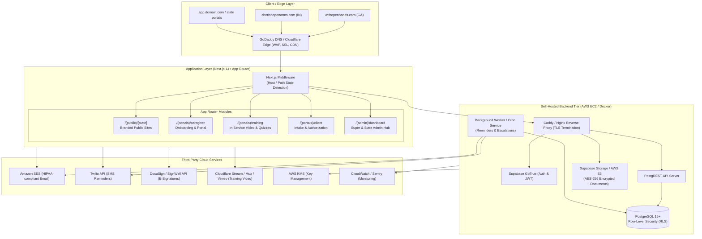
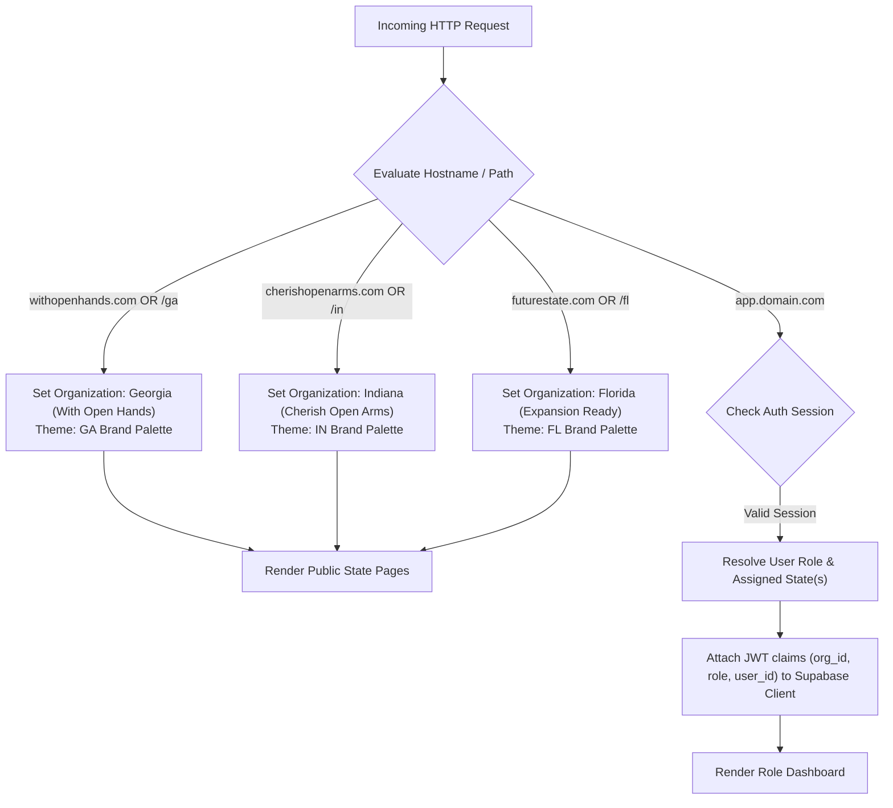
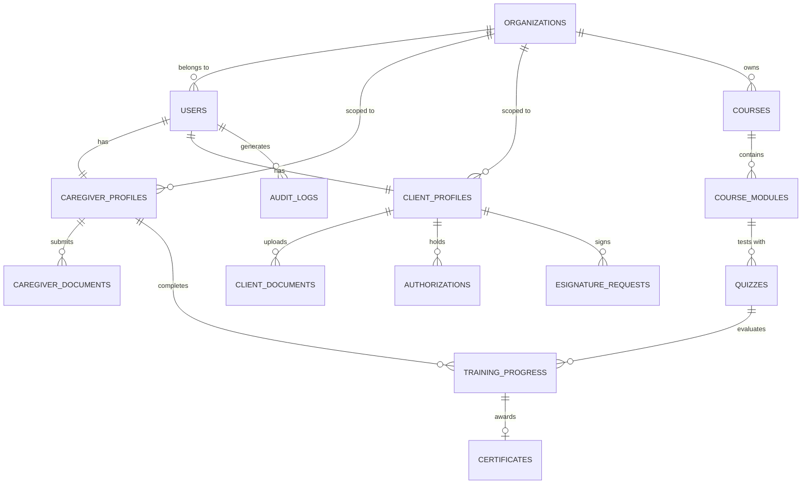
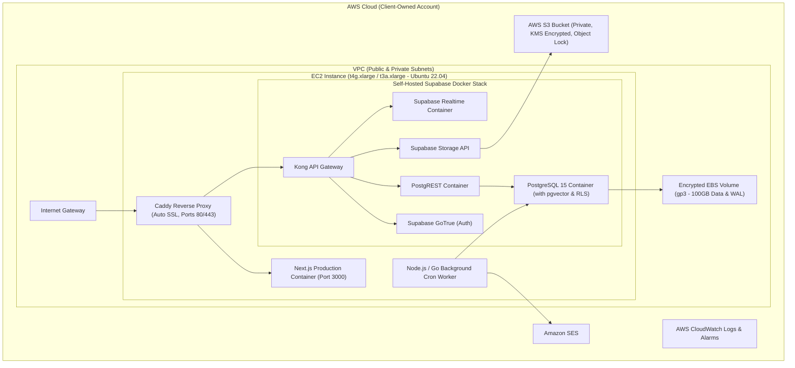

# Technical Architecture Specification

## 1. System Overview & High-Level Architecture

The platform uses a modern, unified multi-tenant architecture designed to host both state operations (**Georgia — With Open Hands** and **Indiana — Cherish Open Arms**) with zero-downtime scalability for future expansion (e.g., **Florida**).



---

## 2. Technology Stack & Component Specifications

| Tier | Technology | Rationale & Specifications |
| :--- | :--- | :--- |
| **Frontend Framework** | **Next.js 14+ (App Router)** + **TypeScript** | Server-Side Rendering (SSR) for SEO-optimized public state pages; React Server Components (RSC) and Server Actions for high-performance secure portals. |
| **Styling & UI** | **Tailwind CSS** + **shadcn/ui** + **Lucide Icons** | Accessible (ARIA-compliant), highly customizable component library with dynamic CSS variables for state branding (e.g. GA vs IN brand palettes). |
| **Backend & DB** | **Self-Hosted Supabase** on **PostgreSQL 15+** | Full open-source Supabase stack (GoTrue Auth, PostgREST, Realtime, Storage engine) providing PostgreSQL power without vendor lock-in. |
| **Data Isolation** | **PostgreSQL Row-Level Security (RLS)** | Kernel-level data segregation by `org_id` / `state_id` and user role, preventing cross-tenant data leaks. |
| **Document Storage** | **Supabase Storage / AWS S3** | Encrypted S3 buckets with private ACLs; time-limited presigned URLs (15-minute expiration) for viewing credentials and medical records. |
| **E-Signatures** | **DocuSign / SignWell REST API** | Webhook-driven e-signature lifecycle for caregiver onboarding packages and client admission consents. |
| **Video Streaming** | **Cloudflare Stream / Mux / Vimeo** | Adaptive bitrate streaming (HLS/DASH) for training videos with player progress tracking hooks. |
| **Notifications** | **Amazon SES** (Email) + **Twilio** (SMS) | Low-cost, highly reliable transactional delivery; stripped of PHI to maintain HIPAA compliance. |
| **Reverse Proxy** | **Caddy / Nginx** | Automatic TLS/SSL certificates via Let's Encrypt / Cloudflare Origin CA, rate limiting, and HTTP/2 proxying. |
| **Hosting & Cloud** | **AWS EC2 (Ubuntu 22.04 LTS)** + **Docker Compose** | Single containerized VM architecture keeping total infrastructure spend within **$100–$200/month**. |

---

## 3. Multi-Tenant & Multi-State Routing Design



### 3.1 Next.js Middleware State Resolution
Next.js middleware inspects incoming domain headers and URL subpaths:
- Custom domain `withopenhands.com` $\rightarrow$ internal route rewrite to `/(public)/ga`
- Custom domain `cherishopenarms.com` $\rightarrow$ internal route rewrite to `/(public)/in`
- Portal paths (`/portal/...`) extract user organization context from the authenticated Supabase JWT session claims.

---

## 4. Database Schema & Data Isolation Model



### 4.1 Core Relational Tables

#### `organizations` (Tenants / States)
- `id` (UUID, PK)
- `name` (TEXT) — e.g. "With Open Hands", "Cherish Open Arms"
- `state_code` (VARCHAR(2)) — 'GA', 'IN', 'FL'
- `domain` (TEXT) — 'withopenhands.com', 'cherishopenarms.com'
- `branding_config` (JSONB) — Primary colors, logos, contact info, state license numbers
- `created_at` (TIMESTAMPTZ)

#### `users` (Auth & Profile Mapping)
- `id` (UUID, PK, references `auth.users`)
- `org_id` (UUID, FK $\rightarrow$ `organizations.id`)
- `role` (ENUM: `super_admin`, `state_admin`, `agency_staff`, `training_admin`, `caregiver`, `client`)
- `email` (TEXT, UNIQUE)
- `first_name` (TEXT), `last_name` (TEXT), `phone` (TEXT)
- `status` (ENUM: `pending`, `active`, `suspended`, `archived`)
- `created_at` (TIMESTAMPTZ)

#### `caregiver_profiles`
- `id` (UUID, PK)
- `user_id` (UUID, FK $\rightarrow$ `users.id`)
- `org_id` (UUID, FK $\rightarrow$ `organizations.id`)
- `application_status` (ENUM: `draft`, `submitted`, `under_review`, `approved`, `rejected`)
- `application_data` (JSONB) — Full form responses, work history, references
- `compliance_status` (ENUM: `compliant`, `expiring_soon`, `non_compliant`, `action_required`)
- `hired_at` (TIMESTAMPTZ)

#### `caregiver_documents` (Credentials & Onboarding Files)
- `id` (UUID, PK)
- `caregiver_id` (UUID, FK $\rightarrow$ `caregiver_profiles.id`)
- `org_id` (UUID, FK $\rightarrow$ `organizations.id`)
- `category` (ENUM: `drivers_license`, `ssn`, `cpr`, `cna_hha_cert`, `tb_test`, `physical_exam`, `background_check`, `auto_insurance`, `direct_deposit`, `other`)
- `file_path` (TEXT) — S3 key in private bucket
- `file_name` (TEXT), `mime_type` (TEXT), `file_size` (INT)
- `expiration_date` (DATE, NULLABLE)
- `verification_status` (ENUM: `pending`, `approved`, `rejected`, `expired`)
- `verified_by` (UUID, FK $\rightarrow$ `users.id`, NULLABLE)
- `verified_at` (TIMESTAMPTZ, NULLABLE)
- `admin_notes` (TEXT)

#### `courses` & `training_progress`
- `courses`: `id`, `org_id` (NULL for global, UUID for state-specific), `title`, `description`, `video_url`, `passing_score`, `hours_credit`
- `training_progress`: `id`, `user_id`, `course_id`, `status` (`not_started`, `in_progress`, `passed`, `failed`), `quiz_score` (NUMERIC), `completed_at` (TIMESTAMPTZ)
- `certificates`: `id`, `progress_id`, `certificate_number` (UNIQUE), `pdf_storage_path` (TEXT), `issued_at` (TIMESTAMPTZ)

#### `client_profiles` & `authorizations`
- `client_profiles`: `id`, `user_id`, `org_id`, `medicaid_id` (TEXT), `primary_diagnosis` (TEXT), `intake_status` (`draft`, `submitted`, `active`, `discharged`), `service_start_date` (DATE)
- `authorizations`: `id`, `client_id`, `org_id`, `payer_name` (TEXT), `auth_number` (TEXT), `start_date` (DATE), `end_date` (DATE), `authorized_units` (INT), `status` (`active`, `expiring_soon`, `expired`)
- `client_documents`: `id`, `client_id`, `org_id`, `category` (`insurance_card`, `medicaid_doc`, `physician_order`, `plan_of_care`, `poa_authorization`), `file_path` (TEXT)

#### `audit_logs` (Security & HIPAA Compliance)
- `id` (BIGSERIAL, PK)
- `actor_id` (UUID, FK $\rightarrow$ `users.id`)
- `org_id` (UUID, FK $\rightarrow$ `organizations.id`)
- `action` (TEXT) — e.g. `VIEW_DOCUMENT`, `UPDATE_AUTHORIZATION`, `APPROVE_CAREGIVER`
- `target_entity` (TEXT), `target_id` (TEXT)
- `ip_address` (INET), `user_agent` (TEXT)
- `created_at` (TIMESTAMPTZ DEFAULT NOW())

---

## 5. Row-Level Security (RLS) Policy Specifications

PostgreSQL RLS ensures complete isolation at the database layer:

```sql
-- Enable RLS on core tables
ALTER TABLE organizations ENABLE ROW LEVEL SECURITY;
ALTER TABLE caregiver_documents ENABLE ROW LEVEL SECURITY;
ALTER TABLE client_profiles ENABLE ROW LEVEL SECURITY;
ALTER TABLE authorizations ENABLE ROW LEVEL SECURITY;

-- Helper function to get current user's org_id and role from JWT claims
CREATE OR REPLACE FUNCTION current_user_org() RETURNS UUID AS $$
  SELECT NULLIF(current_setting('request.jwt.claims', true)::jsonb->'app_metadata'->>'org_id', '')::UUID;
$$ LANGUAGE SQL STABLE;

CREATE OR REPLACE FUNCTION current_user_role() RETURNS TEXT AS $$
  SELECT NULLIF(current_setting('request.jwt.claims', true)::jsonb->'app_metadata'->>'role', '')::TEXT;
$$ LANGUAGE SQL STABLE;

-- RLS Policy: Super Admins have global access
CREATE POLICY super_admin_all ON caregiver_documents
  FOR ALL
  USING (current_user_role() = 'super_admin');

-- RLS Policy: State Admins & Staff access only their state/organization
CREATE POLICY state_staff_org_access ON caregiver_documents
  FOR ALL
  USING (
    current_user_role() IN ('state_admin', 'agency_staff') 
    AND org_id = current_user_org()
  );

-- RLS Policy: Caregivers can only access their own documents
CREATE POLICY caregiver_own_docs ON caregiver_documents
  FOR ALL
  USING (
    current_user_role() = 'caregiver' 
    AND caregiver_id IN (SELECT id FROM caregiver_profiles WHERE user_id = auth.uid())
  );
```

---

## 6. AWS Infrastructure & Self-Hosted Topology ($100–$200/mo)



### 6.1 Cost Breakdown Estimation (Target: $100 – $200 / month)

| AWS Resource | Configuration / Plan | Estimated Monthly Cost |
| :--- | :--- | :--- |
| **AWS EC2 Compute** | `t4g.xlarge` (4 vCPU, 16GB RAM, ARM64) or `t3a.xlarge` (Savings Plan) | $65 – $95 / month |
| **Amazon EBS Storage** | 100 GB `gp3` SSD (3000 IOPS, 125 MB/s throughput, Encrypted) | $8 – $10 / month |
| **AWS S3 Storage** | Encrypted Standard S3 for Document Repository & DB Backups (50 GB) | $1.50 – $3 / month |
| **AWS KMS** | Customer Managed Key for Database and S3 SSE | $1.00 / month |
| **Amazon SES** | Up to 20,000 transactional emails/month | $2.00 / month |
| **Cloudflare DNS & CDN** | Free Tier / Pro ($20/mo optional for advanced WAF) | $0 – $20 / month |
| **Twilio SMS** | ~$0.0079/SMS (~500 SMS alerts/mo) | $4 – $8 / month |
| **DocuSign / SignWell** | API Starter Plan / Tiered Usage | Variable / Tiered ($15–$30/mo) |
| **Estimated Total** | **All Core Services Included** | **~$95 – $170 / month** |

---

## 7. Security, HIPAA-Ready Controls & Auditability

1. **Encryption Standards:**
   - **In-Transit:** Mandatory HTTPS/TLS 1.3 enforced by Caddy/Cloudflare with HSTS preloaded headers.
   - **At-Rest:** AWS EBS encrypted using AWS KMS keys; S3 buckets configured with AES-256 Server-Side Encryption (`aws:kms` or `AES256`).
2. **Access Control & Least Privilege:**
   - Database operations executed through strictly scoped PostgREST roles (`anon`, `authenticated`, `service_role`).
   - IAM policies strictly limit EC2 instance profile access to designated S3 buckets and SES identity ARNs.
3. **Audit Logging & Tamper Resistance:**
   - Every file download, credential verification, and client record inspection logs an entry in `audit_logs`.
   - Admin access to raw database tables is restricted to SSH key-pair bastion or AWS SSM Session Manager.
4. **Automated Disaster Recovery & Backups:**
   - Daily automated PostgreSQL WAL archiving to S3 using `pgBackRest` or `wal-g`.
   - Daily automated EBS volume snapshots with 30-day retention policies.
