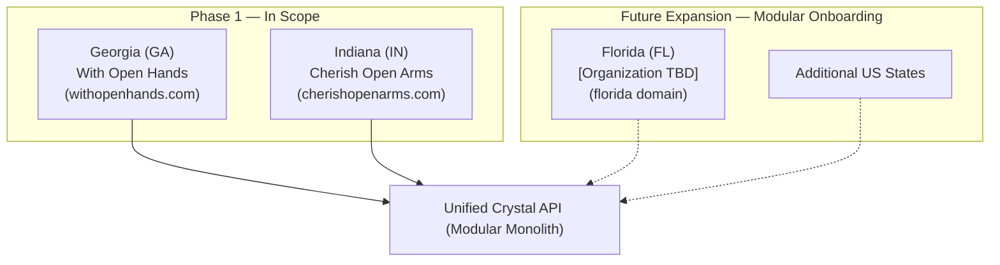
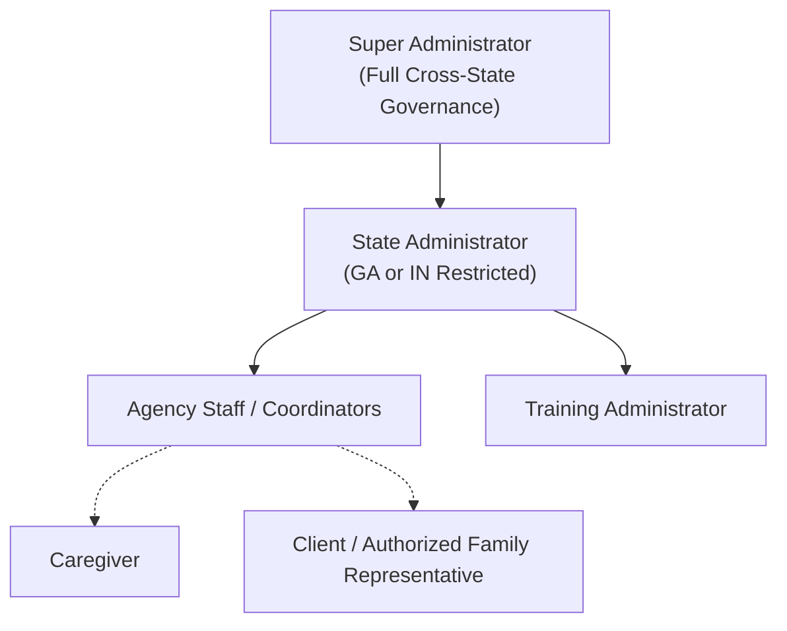
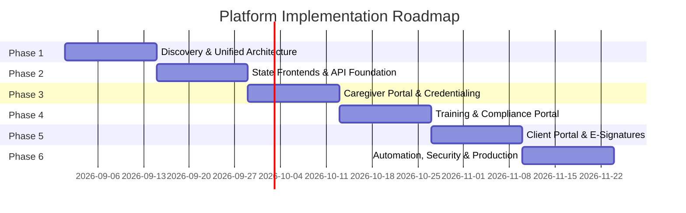

# Master Context & Scope of Services

## 1. Executive Summary & Purpose

This document serves as the **definitive functional and architectural source of truth** for the **Crystal Multi-State Home Care Platform**. It details the business requirements, operational workflows, organizational scope, core architecture, and delivery milestones for **Phase 1** and future state expansions.

The platform unifies two distinct state operating entities under a shared digital infrastructure:
- **Georgia (GA):** Operating as **With Open Hands**
- **Indiana (IN):** Operating as **Cherish Open Arms**
- **Future Expansion:** Prepared for **Florida (FL)** and subsequent state operations without requiring a foundational rebuild or duplicated backends.

> [!IMPORTANT]
> **Core Architectural Principle:**
> Crystal uses multiple state-specific Next.js frontend applications that communicate with one centralized Unified API. The Unified API is a modular monolith and is responsible for shared backend functionality and business logic. State-specific applications must not create duplicate backend implementations unless explicitly justified.

---

## 2. Key Stakeholders & Project Information

| Role | Entity / Contact | Details |
| :--- | :--- | :--- |
| **Client** | Crystal | *With Open Hands* (GA) & *Cherish Open Arms* (IN) |
| **Service Provider** | Johnrey Mansilungan | ST Business Consulting Network |
| **Effective Date** | August 24, 2026 | Scope Version: 1 (Architectural Revision v2) |
| **Estimated Timeline** | 8 – 12 Weeks | 6 Phased Sprints |
| **Cloud Infra Budget** | $100 – $200 / month | Self-hosted AWS deployment model (EC2 + Docker Compose) |
| **Optional Maintenance** | $200 / month | Bug fixes, security updates, monitoring, support |

---

## 3. High-Level System Architecture

Crystal implements a **Multi-State Frontend + Unified API + Centralized Backend Infrastructure** pattern:

```text
Georgia Domain (withopenhands.com)
      ↓
Georgia Next.js App
      │
      ├──────────────┐
      │              │
Indiana Domain (cherishopenarms.com)
      ↓              │
Indiana Next.js App  │
      │              │
      └──────┬───────┘
             ↓
      Unified Crystal API
       (Modular Monolith)
             ↓
   ┌─────────┼──────────┐
   ↓         ↓          ↓
PostgreSQL Storage   External Services
/Supabase             SES / Twilio /
                      DocuSign / Video
```

### 3.1 State Frontends
Each state/organization operates its own:
- **Domain:** e.g., `withopenhands.com` (GA), `cherishopenarms.com` (IN)
- **Next.js Application:** Tailored public pages, routing, navigation, and client-side presentation
- **State-Specific Website Content:** Services offered, local contact information, and executive leadership
- **State-Specific Forms & Licensing Info:** State regulatory disclosures (e.g., Georgia DCH vs. Indiana FSSA), local office locations, and state license numbers
- **State-Specific Frontend Configuration:** Custom color themes, logos, assets, and metadata

### 3.2 Unified API (Modular Monolith)
The backend is built as a **single, unified application with cleanly separated internal modules** (not a set of microservices). It owns all centralized business logic, authentication, state isolation, compliance rules, validation, and data persistence.

### 3.3 Centralized Database & Infrastructure
A single, centralized PostgreSQL database with Row-Level Security (RLS) hosts all tenant data with strict organization isolation. Secure object storage (Supabase Storage / AWS S3) protects sensitive documents.

---

## 4. Organizational & Multi-State Scope



### 4.1 Included in Phase 1
- **State-Specific Next.js Frontend Applications:** Distinct web experiences for Georgia (*With Open Hands*) and Indiana (*Cherish Open Arms*).
- **Unified Crystal API (Modular Monolith):** Shared backend application exposing standardized endpoints (`/api/v1/...`).
- **Dynamic State Switching & Navigation:** State switcher allowing users/clients to switch state contexts while preserving intent.
- **State-Specific Compliance & Licensing Content:** Disclosures, regulatory forms, and services tailored per state.
- **Lead Capture & Contact Form Integration:** Transitioning existing GoDaddy capture forms into a unified lead pipeline in PostgreSQL.
- **Unified Design System:** Shared modern component library (`packages/ui` with shadcn/ui + Tailwind CSS) with state-specific brand token overrides.
- **Strict Multi-Tenant Row-Level Security:** Database-level isolation allowing rapid provisioning of future state organizations without code duplication.

### 4.2 Excluded from Phase 1 (Future Work / Change Requests)
- Florida (FL) specific localization and operational rollout (scoped separately).
- Native mobile applications (iOS/Android).
- Electronic Visit Verification (EVV) direct state aggregator integrations.
- Electronic Health Record (EHR) and external medical billing/claims clearinghouse integrations.
- Payroll direct processing.

---

## 5. Core Functional Modules (Functional Source of Truth)

The functional requirements below define the complete feature scope of the platform.

### 5.1 Caregiver Portal & Onboarding Funnel
1. **Application Lifecycle:**
   - Account creation via email/password or magic links.
   - Multi-step online employment application with progress auto-saving.
   - Onboarding status tracker (`Applicant` $\rightarrow$ `Background Check` $\rightarrow$ `Document Submission` $\rightarrow$ `Training` $\rightarrow$ `Active`).
2. **Secure Document Management:**
   - Driver's License & Government Photo ID.
   - Social Security Card.
   - CPR / First Aid Certification.
   - CNA / HHA State Licenses and Certifications.
   - TB Test Results (PPD / QuantiFERON) & Physical Examination records.
   - Background Check Authorization & Completed Background Check.
   - Auto Insurance & Driver's Insurance policies.
   - Direct Deposit Authorization Forms & W-4/I-9 compliance.
3. **Automated Credential Tracking:**
   - Document expiration date indexing.
   - Missing, pending, expired, and expiring-soon (30/60/90-day) status tagging.
   - Automated renewal reminder notifications via Email & SMS.
4. **Caregiver Dashboard:**
   - Profile management and contact info updates.
   - Real-time compliance progress meter.
   - Access to assigned in-service training modules.
   - Agency announcements and notification inbox.

### 5.2 In-Service Training & Continuing Education Portal
1. **Course Catalog & Delivery:**
   - State-mandated training topics (e.g., Elder Abuse Prevention, Infection Control, HIPAA, Client Rights, Emergency Procedures).
   - Video lessons hosted via high-performance streaming (Cloudflare Stream / Mux).
   - Downloadable reading guides and resource materials.
2. **Assessment & Compliance:**
   - Integrated end-of-module quizzes and knowledge checks with configurable passing thresholds ($\ge 80\%$).
   - Retake limits and answer verification.
   - Automatic certificate generation (PDF download with verification serial numbers and signatures).
   - Caregiver in-service hour accumulation tracking.
   - Administrator training completion and audit reporting.

### 5.3 Client Portal & Intake Management
1. **Digital Intake & Admission:**
   - Online intake forms capturing patient medical history, emergency contacts, primary care physicians, and care requirements.
   - Admission document download and review.
   - Integrated e-signatures for client service agreements, consents, and liability waivers (DocuSign / SignWell).
   - Real-time admission status tracking.
2. **Client Document Storage:**
   - Insurance cards (front & back).
   - Medicaid / Medicare eligibility documents.
   - Physician orders & medical clearance.
   - Individualized Plan of Care (POC).
   - Power of Attorney (POA) & Legal Guardian Authorizations.
3. **Authorization Management:**
   - Active insurance and Medicaid authorization tracking.
   - Authorized unit/hours limits and service date ranges.
   - Expiration alerts and renewal workflow triggers.
4. **Client Dashboard:**
   - Patient profile and assigned care plan overview.
   - Scheduled visit calendar/service schedule view.
   - Uploaded documents repository (secure access).
   - Agency announcements and notification center.

### 5.4 Administrator Governance Dashboard
1. **Caregiver Management:**
   - Application queue review, approval, rejection, and request-for-info workflows.
   - Credential compliance matrix with one-click reminder dispatch.
   - Full audit trail of uploaded documents and verification history.
2. **Client Management:**
   - Referral pipeline and intake form review.
   - Authorization status monitoring and missing document alerts.
   - Service start date scheduling.
3. **Reporting & Analytics:**
   - Caregiver Compliance & Expiring Credential Reports.
   - In-Service Training Completion & Hours Reports.
   - Client Authorization Expiration Reports.
   - Referral Source & Website Lead Conversion Reports.
   - State-filtered CSV/PDF report exports.

---

## 6. User Roles & Access Control Matrix



| Role | Scope | Key Capabilities |
| :--- | :--- | :--- |
| **Super Administrator** | All States (GA, IN, Future FL) | Full system configuration, user provisioning, global cross-state reporting, infrastructure oversight, state provisioning. |
| **State Administrator** | Single Assigned State (GA or IN) | Local caregiver and client management, state-specific document review, local compliance monitoring, state-filtered reports. |
| **Agency Staff** | Assigned State | Intake processing, daily document verification, reminder triggers, client onboarding assistance. |
| **Training Administrator** | Global or Assigned State | Course catalog authoring, video upload, quiz management, certificate audit. |
| **Caregiver** | Individual Account | Online application, document uploads, credential tracking, in-service video training, certificate downloads. |
| **Client / Family Rep** | Individual Account | Digital intake completion, e-signing admission packets, document uploads, care schedule viewing. |

---

## 7. State and Organization Isolation Model

State isolation is **enforced on the backend and database layer**, never solely on the frontend:

```text
Georgia User Request
   ↓
Authenticated Session (JWT with user_id, org_id, role)
   ↓
Unified API Authorization Guard (verifies route & org permissions)
   ↓
PostgreSQL Row-Level Security (RLS restricts query to org_id)
   ↓
Georgia-Authorized Data Returned
```

1. **Identity & Context:** Every authenticated request identifies the user, their role, and their assigned organization (`org_id` / `state_code`).
2. **Backend Enforcement:** The Unified API validates that the user's role and organization grant access to the requested resource before invoking database operations.
3. **Database RLS:** PostgreSQL Row-Level Security policies guarantee that even if an API query omitted a filter, cross-tenant data leakage is physically prevented at the engine level.
4. **Cross-Tenant Protection:** A Georgia user or state admin cannot access Indiana records by altering URLs, headers, or query payloads.

---

## 8. Secure Document Architecture

Crystal processes sensitive caregiver PII (SSNs, background checks, medical clearances) and client PHI (insurance policies, medical orders, diagnoses):

- **Non-Public Storage:** Documents are **never** stored in public web directories.
- **Encrypted Storage:** All files are stored in private Supabase Storage / AWS S3 buckets using AES-256 server-side encryption.
- **Separation of Concerns:** The database stores metadata, expiration dates, verification status, and storage references. The physical files reside in private object storage.
- **Authorized Ephemeral Access:** File downloads and previews are delivered exclusively through time-limited, cryptographically signed URLs (15-minute expiration), issued only after the Unified API verifies user authorization and organization context.

---

## 9. Automation & Multi-Channel Notifications

- **Transactional Email (Amazon SES):**
  - Account invitations, password resets, onboarding milestone notices.
  - Document upload receipts and approval/rejection feedback.
  - Credential & Authorization expiration reminders (90, 60, 30, 15, 7, 0 days).
- **SMS Alerts (Twilio):**
  - Urgent credential expiration warnings (30, 15, 7 days).
  - E-signature signing requests and intake reminders.
  - Real-time notifications for coordinators upon new application submissions.
- **HIPAA Security Guardrail:**
  - Standard SMS and email communications **must never contain PHI or sensitive PII**.
  - Notifications deliver generic, actionable alerts with secure links prompting the user to authenticate into the portal.

---

## 10. Project Delivery Timeline & Phasing (8 – 12 Weeks)



1. **Phase 1 — Discovery & Unified Architecture (Weeks 1–2):** Finalize monorepo structure, unified API module boundaries, PostgreSQL schemas, RLS policies, and hosting topology.
2. **Phase 2 — State Frontends & Platform Foundation (Weeks 3–4):** Georgia and Indiana Next.js apps, shared `packages/ui`, Unified API auth module, and public lead capture.
3. **Phase 3 — Caregiver Portal (Weeks 5–6):** Onboarding workflows, secure document uploader, credential expiration indexing, and admin verification views.
4. **Phase 4 — In-Service Training & Compliance (Weeks 7–8):** Video player integration, quiz engine, automated PDF certificate issuance, and compliance reporting.
5. **Phase 5 — Client Portal & E-Signatures (Weeks 9–10):** Digital intake forms, DocuSign/SignWell e-signing, authorization tracking, and client dashboards.
6. **Phase 6 — Automation, Reporting & Production Finalization (Weeks 11–12):** Scheduled cron reminder workers, audit logging, security hardening, cross-browser/mobile testing, production deployment, and client handover.

---

## 11. HIPAA & Compliance Governance

> [!IMPORTANT]
> The platform is engineered using **HIPAA-ready** and **security-by-design** principles:
> - AES-256 encryption at rest (AWS KMS) and TLS 1.3 in transit.
> - Strict PostgreSQL Row-Level Security (RLS) enforcing tenant isolation.
> - Private S3/Storage buckets with signed, expiring URLs for all credential and medical documents.
> - Immutable audit logging (`security_audit_logs`) capturing all PHI/PII queries.
> - Zero PHI in emails, SMS, and application logs.
> 
> Legal HIPAA certification requires client-executed Business Associate Agreements (BAAs) with AWS, Twilio, and DocuSign, alongside organizational compliance policies.
