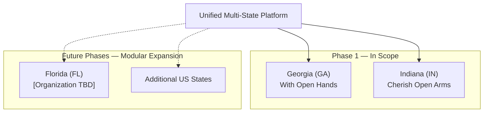
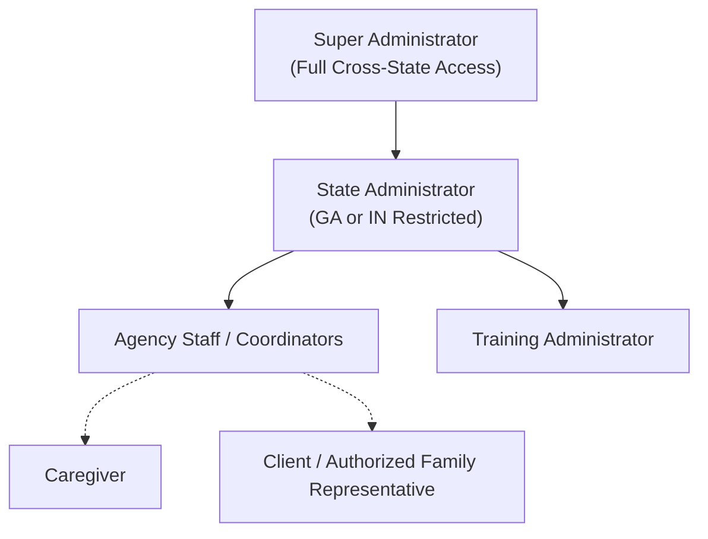
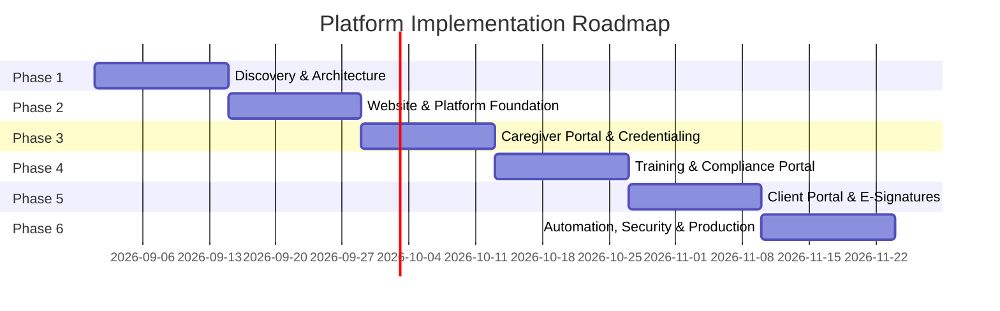

# Project Context & Scope of Services

## 1. Executive Summary & Purpose

This document details the business requirements, operational workflows, organizational scope, and delivery milestones for the **Georgia & Indiana Home Care Agency Website & Portal Platform (Phase 1)**.

The initiative consolidates two distinct state operating entities under a unified, scalable digital platform:
- **Georgia (GA):** Operating as **With Open Hands**
- **Indiana (IN):** Operating as **Cherish Open Arms**
- **Future Expansion:** Architecture designed for **Florida (FL)** and subsequent state operations without requiring a foundational rebuild.

The platform provides a centralized, multi-tenant digital ecosystem supporting public-facing agency websites, caregiver recruitment & onboarding, compliance credentialing, in-service continuing education, client intake & authorization management, and unified administrative governance.

---

## 2. Key Stakeholders & Project Information

| Role | Entity / Contact | Details |
| :--- | :--- | :--- |
| **Client** | Crystal | *With Open Hands* (GA) & *Cherish Open Arms* (IN) |
| **Service Provider** | Johnrey Mansilungan | ST Business Consulting Network |
| **Effective Date** | August 24, 2026 | Scope Version: 1 |
| **Estimated Timeline** | 8 – 12 Weeks | 6 Phased Sprints |
| **Cloud Infra Budget** | $100 – $200 / month | Self-hosted AWS deployment model |
| **Optional Maintenance** | $200 / month | Bug fixes, security updates, monitoring, support |

---

## 3. Organizational & Multi-State Scope

### 3.1 Included in Phase 1
- **State-Specific Public Web Pages:** Branded experiences for Georgia (*With Open Hands*) and Indiana (*Cherish Open Arms*).
- **Dynamic State Switching & Navigation:** Seamless geolocation-aware or user-selected state context.
- **State-Specific Compliance & Licensing Content:** Disclosures, regulatory forms, and services tailored per state.
- **Lead Capture & Contact Form Integration:** Transitioning existing GoDaddy capture forms into unified lead pipelines.
- **Unified Design System:** Shared modern aesthetic (shadcn/ui + Tailwind CSS) with dynamic state/brand theming.
- **Modular Multi-Tenant Architecture:** Database-level isolation allowing rapid provisioning of future state organizations.

### 3.2 Excluded from Phase 1 (Future Work / Change Requests)
- Florida (FL) specific localization and operational rollout (scoped separately).
- Native mobile applications (iOS/Android).
- Electronic Visit Verification (EVV) direct state aggregator integrations.
- Electronic Health Record (EHR) and external medical billing/claims clearinghouse integrations.
- Payroll direct processing.

---

## 4. Core Functional Modules

### 4.1 Caregiver Portal & Onboarding Funnel
1. **Application Lifecycle:**
   - Account creation via email/password or magic links.
   - Multi-step online employment application with progress auto-saving.
   - Onboarding status tracker (Applicant $\rightarrow$ Background Check $\rightarrow$ Document Submission $\rightarrow$ Training $\rightarrow$ Active).
2. **Secure Document Management:**
   - Driver's License & Government Photo ID.
   - Social Security Card.
   - CPR / First Aid Certification.
   - CNA / HHA State Licenses and Certifications.
   - TB Test Results (PPD / QuantiFERON) & Physical Examination records.
   - Background Check Authorization & Completed Background Check.
   - Auto Insurance & Driver's Insurance policies.
   - Direct Deposit Authorization Forms & W-4/I-9 compliance.
3. **Automated Credential Tracking:**
   - Document expiration date indexing.
   - Missing, pending, expired, and expiring-soon (30/60/90-day) status tagging.
   - Automated renewal reminder notifications.
4. **Caregiver Dashboard:**
   - Profile management and contact info updates.
   - Real-time compliance progress meter.
   - Access to assigned in-service training modules.
   - Agency announcements and notification inbox.

### 4.2 In-Service Training & Continuing Education Portal
1. **Course Catalog & Delivery:**
   - State-mandated training topics (e.g., Elder Abuse Prevention, Infection Control, HIPAA, Client Rights, Emergency Procedures).
   - Video lessons hosted via high-performance streaming.
   - Downloadable reading guides and resource materials.
2. **Assessment & Compliance:**
   - Integrated end-of-module quizzes and knowledge checks with configurable passing thresholds.
   - Retake limits and answer verification.
   - Automatic certificate generation (PDF download with verification serial numbers).
   - Caregiver in-service hour accumulation tracking.
   - Administrator training completion and audit reporting.

### 4.3 Client Portal & Intake Management
1. **Digital Intake & Admission:**
   - Online intake forms capturing patient medical history, emergency contacts, primary care physicians, and care requirements.
   - Admission document download and review.
   - Integrated e-signatures for client service agreements, consents, and liability waivers.
   - Real-time admission status tracking.
2. **Client Document Storage:**
   - Insurance cards (front & back).
   - Medicaid / Medicare eligibility documents.
   - Physician orders & medical clearance.
   - Individualized Plan of Care (POC).
   - Power of Attorney (POA) & Legal Guardian Authorizations.
3. **Authorization Management:**
   - Active insurance and Medicaid authorization tracking.
   - Authorized unit/hours limits and service date ranges.
   - Expiration alerts and renewal workflow triggers.
4. **Client Dashboard:**
   - Patient profile and assigned care plan overview.
   - Scheduled visit calendar/service schedule view.
   - Uploaded documents repository.
   - Agency announcements and notification center.

### 4.4 Administrator Governance Dashboard
1. **Caregiver Management:**
   - Application queue review, approval, rejection, and request-for-info workflows.
   - Credential compliance matrix with one-click reminder dispatch.
   - Full audit trail of uploaded documents and verification history.
2. **Client Management:**
   - Referral pipeline and intake form review.
   - Authorization status monitoring and missing document alerts.
   - Service start date scheduling.
3. **Reporting & Analytics:**
   - Caregiver Compliance & Expiring Credential Reports.
   - In-Service Training Completion & Hours Reports.
   - Client Authorization Expiration Reports.
   - Referral Source & Website Lead Conversion Reports.
   - State-filtered CSV/PDF report exports.

---

## 5. User Roles & Access Control Matrix

| Role | Scope | Key Capabilities |
| :--- | :--- | :--- |
| **Super Administrator** | All States (GA, IN, Future FL) | Full system configuration, user provisioning, global reporting, infrastructure/billing oversight, state provisioning. |
| **State Administrator** | Single Assigned State (GA or IN) | Local caregiver and client management, state-specific document review, local compliance monitoring, state reports. |
| **Agency Staff** | Assigned State | Intake processing, daily document verification, reminder triggers, client onboarding assistance. |
| **Training Administrator** | Global or Assigned State | Course catalog authoring, video upload, quiz management, certificate audit. |
| **Caregiver** | Individual Account | Online application, document uploads, credential tracking, in-service video training, certificate downloads. |
| **Client / Family Rep** | Individual Account | Digital intake completion, e-signing admission packets, document uploads, care schedule viewing. |

---

## 6. Automation & Multi-Channel Notifications

- **Transactional Email (Amazon SES):**
  - Account invitations, password resets, onboarding milestone notices.
  - Document upload receipts and approval/rejection feedback.
  - Credential & Authorization expiration reminders (90, 60, 30, 15, 7, 0 days).
- **SMS Alerts (Twilio):**
  - Urgent credential expiration warnings.
  - E-signature signing requests.
  - Immediate notification of new referral/application submissions to coordinators.
- **Privacy & HIPAA Security Rule:**
  - Standard SMS and email communications **must never** contain Protected Health Information (PHI) or Sensitive Personally Identifiable Information (PII).
  - Messages will contain secure, authenticated links directing users to sign into the portal.

---

## 7. Project Delivery Timeline & Phasing (8 – 12 Weeks)

1. **Phase 1 — Discovery & Architecture (Weeks 1–2):** Finalize schemas, RLS rules, UI design tokens, AWS hosting topology, and third-party API accounts.
2. **Phase 2 — Website & Platform Foundation (Weeks 3–4):** Public state pages (GA & IN), auth system, multi-tenant middleware, base admin layouts.
3. **Phase 3 — Caregiver Portal (Weeks 5–6):** Application forms, file uploaders, expiration date tracking, and admin caregiver review dashboards.
4. **Phase 4 — In-Service Training & Compliance (Weeks 7–8):** Video player, quiz evaluation engine, automated PDF certificate generator, training reporting.
5. **Phase 5 — Client Portal & E-Signatures (Weeks 9–10):** Digital intake workflows, DocuSign/SignWell integration, authorization tracking, client dashboards.
6. **Phase 6 — Automation, Reporting & Production Finalization (Weeks 11–12):** Cron reminders, audit logging, security hardening, load/mobile testing, production deployment, client handover.

---

## 8. HIPAA & Compliance Governance

> [!IMPORTANT]
> The platform is built using **HIPAA-ready** and **security-by-design** architectural principles (AES-256 encryption at rest, TLS 1.3 in transit, strict PostgreSQL Row-Level Security, private S3/Storage buckets with signed URLs, and comprehensive audit trails).
> 
> Technical controls provide the foundation for compliance, but legal and regulatory certification requires client-executed Business Associate Agreements (BAAs) with third-party vendors (AWS, Twilio, DocuSign), organizational workforce policies, and internal risk assessments.
